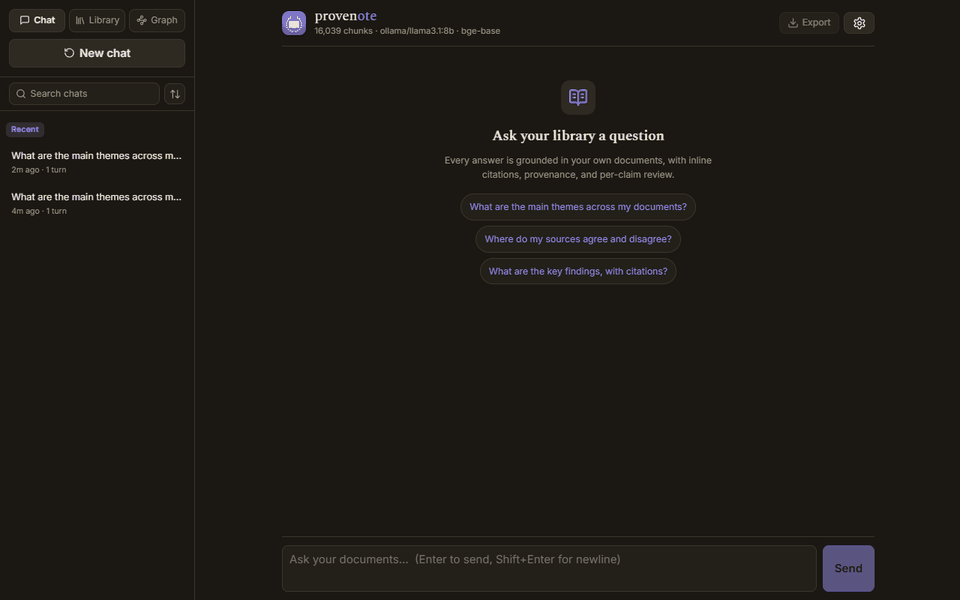
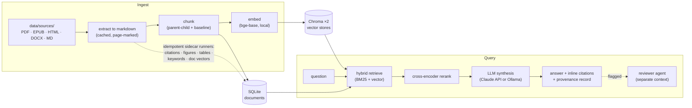

# Provenote

A local-first RAG assistant over your own document corpus (PDF, EPUB, HTML, DOCX, Markdown) that answers questions with inline, page-level citations and measures whether those answers are any good. Document-format-agnostic by design; the test corpus here is research papers because they're real and freely available, but nothing assumes academia.

Not a chatbot wrapper. A fluent answer with a confident citation is not the same as a correct one, so this system is built to *prove* its answers rather than just emit them: page-level citations you can click through, a provenance record on every response, and a separate reviewer that can re-grade a flagged answer. You can even disable LLM generation entirely and rely on the retrieval layer alone. It implements established RAG techniques rather than new algorithms — what it contributes is the integrity layer and the measurement behind it.



## Engineering highlights

- **Settings are locked by experiment, not intuition.** TOP_K, parent-child retrieval, chunk sizes, and the BM25/vector mix were each picked by measuring alternatives with the in-repo eval harness. The reasoning behind each non-obvious choice — and what didn't make the cut — is indexed in [`docs/decisions.md`](docs/decisions.md) (per-decision ADRs; the early design rationale is preserved verbatim in [`docs/archive/decisions-monolith.md`](docs/archive/decisions-monolith.md)).
- **Benchmarks anyone can re-run.** The public eval set runs over a corpus rebuilt from arXiv — 5 trials, reported as mean ± trial-mean std, caveats stated alongside (headline: [Benchmarks](#benchmarks); full results + reproduction: [`evals/`](evals/README.md)). What each scorer measures and why: [`tests/eval/TESTING.md`](tests/eval/TESTING.md).
- **A research-integrity layer.** Every answer carries a provenance record (retrieved chunks, model, cost); a separate-context reviewer agent re-grades flagged answers; confidence signals keep the UI quiet on clean ones — AI-assisted output that stays auditable.
- **Growth by addition.** Derived data (citations, figures, tables, keywords, doc vectors, the wiki) ships as sidecar modules with idempotent CLI runners that never mutate the chunk store — new capability is a new module, not a rewrite.
- **A local RAG sandbox.** The embedder, chunking, the retrieval candidate pool (`CANDIDATE_K`) and final cut (`TOP_K`), parent-child retrieval, and the LLM backend (Claude API or local Ollama) are config-swappable, with the eval harness on hand to measure what each change does.

## What it does

- **Grounded answers with inline citations** — page numbers and sections, every passage inspectable.
- **Evidence vs. interpretation** — each answer separates what your sources actually say from the AI's synthesis (clearly labelled, with per-claim grounding markers you can accept / reject / edit), so an inference is never mistaken for a fact. See [how answers work](docs/how-answers-work.md).
- **Hybrid retrieval + reranking** — BM25 + vector ensemble, cross-encoder reranker, parent-child chunks.
- **Citation graph** — extracts references, resolves them against your library, exposes in/out edges.
- **Concept graph + gap detection** — a curated-vocabulary, deterministic concept skeleton (LLM used only to annotate existing edges, never to invent structure), with a graph view that surfaces knowledge gaps (single-source concepts, thin bridges, isolated nodes) as leads to read next.
- **Knowledge-currency markers** — answer sources carry advisory `contested` / `superseded trend` chips derived from cross-document stance + publication years; they inform, never gate.
- **Library workspace** — browsable document grid with filters, per-chunk reading view, user-editable metadata (overrides survive re-ingest), safe delete (OS trash first), selective ingestion.
- **Corpus wiki** — derived, linked, cited topic notes synthesized over the corpus; regenerable, never hand-authored.
- **Measurable quality** — eval harness with six scorers (deterministic + LLM judge) and a DuckDB result store.
- **Local-first and pluggable** — Chroma + SQLite on disk; Claude API or local Ollama.
- **Cost transparency** — per-turn and per-session token tracking.

## Architecture



The chunk store is never mutated after ingest — every derived layer (citations, figures, tables,
keywords, the wiki, the concept graph) is an additive sidecar with an idempotent CLI runner
([`docs/architecture.md`](docs/architecture.md)).

## Stack

| Component | Choice |
|---|---|
| Embeddings | `bge-base-en-v1.5` (default, swappable via `EMBEDDING_MODEL`; `specter2` also registered) |
| Reranker | `bge-reranker-base` (local) |
| Vector store | Chroma (local, persistent) |
| Keyword search | BM25 |
| LLM | Claude (API) or Llama 3 / Mistral (local via Ollama) |
| Orchestration | LangChain |
| Document store | SQLite (via SQLAlchemy) |
| UI | Tauri desktop app (Svelte 5 + Vite over a FastAPI/SSE backend) + CLI |
| PDF / table extraction | PyMuPDF4LLM (full-text, default); Marker for high-fidelity tables, run isolated out-of-process on caption-detected table pages (chosen by measurement) — a separate idempotent post-ingest pass; tables enter retrieval on the next ingest |

## Setup

```bash
# Prerequisites: Python 3.12, uv
# Note: use Python 3.12 — 3.14 is not yet supported at runtime (some native
# dependencies aren't cp314-stable; see .claude/KNOWN_ISSUES.md KI-2).
git clone <your-repo-url> doc-assistant
cd doc-assistant

# Pick ONE torch backend extra for your machine (they are mutually exclusive):
uv sync --extra cu130   # NVIDIA GPU box (CUDA) — GPU-accelerated embedder + reranker
# uv sync --extra cpu   # CPU-only box (and CI) — the +cu130 wheel SEGFAULTS without a usable GPU
# add `--extra dev` for the test/lint toolchain, e.g.  uv sync --extra cu130 --extra dev
# on the GPU box, prefix run commands too, e.g.        uv run --extra cu130 python -m doc_assistant.ingest

# Configure
cp .env.example .env   # then fill in your API key
```

> **Why an `--extra`?** uv's `torch-backend` auto-detect is `uv pip`-only (a no-op for
> `uv lock`/`uv sync`/`uv run`), and two same-OS machines can't be distinguished by a lock
> marker — so the torch variant is chosen per machine by a mutually-exclusive extra
> (`cpu` vs `cu130`). Full rationale: [`docs/specs/torch-backend-per-machine.md`](docs/specs/torch-backend-per-machine.md).

> **Hardware — a GPU is strongly recommended.** The embedder (`bge-base`) and the cross-encoder
> reranker run **locally** on every ingest and query, so they benefit a lot from GPU acceleration.
> Install the matching torch extra (Setup above: `--extra cu130` for NVIDIA, `--extra cpu` otherwise);
> `sentence-transformers` then auto-selects the device at runtime (CUDA → MPS → CPU):
>
> - **NVIDIA / CUDA** — `uv sync --extra cu130`. Best supported and the only path benchmarked here:
>   retrieve + rerank ~70 ms on an RTX 4070. Recommended.
> - **Apple Silicon (M-series)** — PyTorch's MPS (Metal) backend is auto-detected, so the embedder
>   and reranker use the Mac's GPU with no config change. Faster than CPU, though generally slower
>   than a discrete CUDA card and **not benchmarked here** (MPS also occasionally falls back to CPU
>   for unsupported ops).
> - **CPU-only** — `uv sync --extra cpu` (Linux and CI too). Works, so a GPU isn't required — but the
>   same step is seconds per query, and re-embedding a corpus (ingest / `--rebuild` / the chunking
>   sweep) is dramatically slower.
>
> (The chat LLM is separate — Claude API or local Ollama — so this is about the local embedder +
> reranker, not the generation model. For local-LLM hardware, see
> [System requirements](#system-requirements).)

> **Windows troubleshooting — SSL crash on `uv`-managed Python.** On some Windows machines the
> app dies instantly with no traceback (`OPENSSL_Uplink(...): no OPENSSL_Applink`) the first time it
> opens an HTTPS connection — a Claude API call, Ollama, or any networked test. The cause is the
> OpenSSL in uv's bundled (python-build-standalone) interpreter; an official CPython is unaffected.
> Fix by rebuilding the venv on an official Python 3.12:
> ```bash
> py install 3.12                                                   # official python.org build
> uv venv --clear --python "$(py -3.12 -c 'import sys;print(sys.executable)')"
> uv sync --all-extras
> ```
> (Behind a TLS-inspecting proxy, prefix uv commands with `UV_NATIVE_TLS=1` so uv trusts the
> Windows certificate store.) Offline work — ingest, embeddings, retrieval — is unaffected either way.

## Usage

```bash
# Drop your documents in data/sources/
mkdir -p data/sources
cp ~/your-papers/*.pdf data/sources/

# Build the index (one-time, then incremental)
uv run python -m doc_assistant.ingest

# Launch the desktop app (Tauri + Svelte over the FastAPI backend) — one command:
just app          # starts backend (8001) + dev UI (1420) in their own windows, opens the browser
                  # (no `just`? scripts/launch_app.cmd double-clicks to the same thing)

# ... or manually, in two shells:
just api                                        # backend on 127.0.0.1:8001
cd apps/desktop && npm install && npm run dev    # dev UI (or: npx tauri dev for a native window)

# Or use the CLI
uv run python apps/cli.py
```

> **No corpus of your own yet? Try it on a ready-made one:** `uv run python -m scripts.download_corpus --demo`
> fetches 28 classic AI papers from arXiv into `data/sources/` — the public eval corpus plus the arXiv
> subset of the rumoured [Sutskever→Carmack reading list](https://30papers.com/) — then ingest as above.
> Done exploring? `--remove-demo --apply` cleanly removes the demo papers again (matched by content
> hash, so renames don't fool it; files go to the Recycle Bin and library entries are safe-deleted).
> (Benchmark numbers always come from the 10-paper eval corpus alone; see [`evals/`](evals/README.md).)

To rebuild from scratch (after changing chunking strategy, for example):

```bash
uv run python -m doc_assistant.ingest --rebuild
```

### Move your library between machines

`data/sources/` is gitignored (your library is yours), so cloning the repo elsewhere doesn't carry your documents. Keep a small **sources manifest** — the private analog of the public-corpus downloader — to reconstitute them:

```bash
uv run python -m scripts.sync_sources               # record data/sources/ -> data/sources_manifest.yaml
# fill in the `url:` for any file not auto-matched, then copy the manifest to the other machine out-of-band
uv run python -m scripts.sync_sources --download    # on the other machine: re-fetch into data/sources/
uv run python -m scripts.sync_sources --verify-only # checksum what's on disk against the manifest
```

The manifest pins each file by SHA-256 + size plus the URL it came from; files matching the public corpus get their URL filled in automatically. It's **gitignored** — share it out-of-band, never commit it (the repo is public).

### Citation graph + similarity edges (Phase 4)

After ingestion, three post-passes populate the data layer:

```bash
# Pull title / authors / year / DOI off each document header
uv run python -m scripts.extract_doc_metadata --apply

# Parse References sections, match to library docs, persist edges
uv run python -m scripts.extract_citations --apply

# Mean-pool chunk embeddings -> doc vectors -> top-K cosine similarity edges
uv run python -m scripts.compute_doc_vectors --apply
```

All three are idempotent. `extract_*` accept `--doc <hash-prefix>` to scope;
`compute_doc_vectors` accepts `--top-k`, `--threshold`, and `--force`.

From the chat UI or CLI:

```
/library                  show all documents (use first 8 chars of ID below)
/document <doc-id>        full details for one document
/cites <doc-id>           papers this document cites (internal + external)
/cited-by <doc-id>        library documents that cite this one
/graph <doc-id>           Mermaid subgraph of internal citation edges
/similar <doc-id>         top-N semantically-similar documents
/bibtex                   render the whole library as BibTeX
```

Also available as CLI utilities:

```bash
uv run python -m scripts.find_duplicates    # byte + content dedup report; never deletes
uv run python -m scripts.export_bibtex      # write docs/library.bib
```

## Project layout

```
src/doc_assistant/    # core library — the RAG answer path lives at the top level
  db/                 #   SQLAlchemy models + additive migrations
  ingest/             #   extract → markdown → chunk → embed → store (+ tables/figures/citations)
  knowledge/          #   corpus-derived layer: keywords, concept skeleton, wiki, gaps, epistemics
  eval/               #   the eval harness (runner, scorers, result store)
apps/                 # UIs — thin shells, no business logic (FastAPI/SSE · Tauri/Svelte · CLI)
scripts/              # idempotent enrichment/eval runners + build tooling
tests/                # unit, integration, eval harness cases + committed baselines
evals/                # benchmark results — the write-ups + how to reproduce each number
docs/                 # architecture, ADRs (docs/decisions/), specs, roadmap, this demo's GIF
data/                 # runtime data (sources, caches, vector stores, SQLite) — not committed
```

See [`docs/architecture.md`](docs/architecture.md) for the data flow and module contracts, and [`docs/decisions.md`](docs/decisions.md) for the decision index. (Agent-facing coordination lives in `AGENTS.md` + `.claude/` — deliberately separate from this human-facing README.)

## Running tests

```bash
# Unit + integration (free, fast)
uv run pytest tests/unit/ tests/integration/

# With coverage
uv run pytest tests/unit/ tests/integration/ --cov=src --cov-report=term-missing

# Evaluation harness — free deterministic scorers
uv run python -m scripts.run_eval

# With LLM judge (Claude Haiku, ~$0.10 for 35 cases)
uv run python -m scripts.run_eval --with-llm-judge

# Public eval — 10 cases on the RAG-literature demo corpus (see evals/README.md)
uv run python -m scripts.download_corpus           # fetches 10 papers from arXiv
uv run python -m doc_assistant.ingest
uv run python -m scripts.run_eval --cases tests/eval/cases.public.yaml --with-llm-judge
```

## Docker

```bash
cp .env.example .env             # fill in your API key
mkdir -p data/sources && cp ~/your-papers/*.pdf data/sources/

docker compose build
docker compose run --rm doc-assistant python -m doc_assistant.ingest
docker compose up
```

The container serves the **headless FastAPI backend** on `http://localhost:8001` (check `http://localhost:8001/api/health`) — the same backend the desktop app's sidecar bundles. The GUI is the Tauri desktop app, which runs on the host (see Usage), not in the container; Docker is for running the API/server. Point a client (or the desktop app's backend URL) at `:8001`.

For local LLM via Ollama, set `LLM_MODE=local` in `.env`. On Linux, ensure Ollama listens on all interfaces: `OLLAMA_HOST=0.0.0.0 ollama serve`.

```bash
docker compose down            # stop, keep data
docker compose down -v         # stop, delete model cache volume
```

## Benchmarks

Quality is measured, not asserted. The eval harness ([`src/doc_assistant/eval/`](src/doc_assistant/eval/)) runs the full RAG pipeline — retrieve, rerank, generate — over a fixed question set, and the headline benchmark is **reproducible by anyone**: a public demo corpus of the 10 arXiv papers behind this project's own methods, pinned by arXiv ID + SHA-256 and fetched by a script. 5 trials on `bge-base` (`--repeat 5`), reported as mean ± trial-mean std:

| Scorer | Mean (n=5) | Trial-mean std | What it measures |
|---|---:|---:|---|
| `citation_overlap` (0-1) | **1.000** | 0.000 | retrieval cited the correct source |
| `contains_all` (0-1) | **0.927** | 0.034 | answer surfaces the required facts |
| `llm_judge` (1-5) | **3.894** | 0.075 | reference-graded answer quality |

`citation_overlap` is **1.000 with zero variance** — retrieval depends only on the deterministic index, so it cites the right paper in all 10 cases, every trial; the generated-answer scorers wobble run-to-run around stable means. Cases are deliberately strict, not tuned to score 1.0.

The full results live in **[`evals/`](evals/README.md)** — the embedder comparison (`bge-base` vs `specter2`), the chunk-size sweep, the BM25/vector-weight sweep, the honest caveats, and step-by-step reproduction. What each scorer measures and why: [`tests/eval/TESTING.md`](tests/eval/TESTING.md); committed reference baselines: [`tests/eval/baselines/`](tests/eval/baselines/).

## Status

**Phase 6 + 7 in progress (as of 2026-07-19).** Shipped: core RAG (Phase 1); measured quality + eval harness (Phases 2 & 5); document store + the redesigned library workspace — grid/list browsing, metadata editing, safe delete, selective ingestion (Phase 3 + L4–L7/S1–S2); citation graph + doc-similarity edges (Phase 4); the research-integrity layer — provenance card, dual evidence/interpretation answers, a separate-context LLM reviewer; the provider-agnostic LLM layer with live in-app provider/model switching (Claude API *or* fully-local Ollama); figures + Marker tables; the corpus wiki; and the full concept-graph stack — curated vocabulary (opt-in graph scope, ADR-018), deterministic Node-A skeleton + confined Node-B LLM stance pass (validated: ADR-008), year-aware `superseded_trend` gating, live answer-time markers, gap detection (deterministic floor + quarantined LLM ceiling), and the desktop graph view. **1,015 tests · ruff / mypy --strict / bandit clean.**

`bge-base` is the default embedder — it performed better in our comparisons, though the better choice depends on the corpus (see the [embedder comparison](evals/README.md#embedder-comparison--bge-base-vs-specter2) in `evals/`).

**Recently:** the codebase was restructured for scale (module-scoped agent context, the `knowledge/` subpackage, a rationalized docs system — ADR-021/022/023), and a dedicated **scale-robustness review** audited the whole knowledge layer against a 0-documents-to-10,000-documents contract ([`docs/REVIEW_2026-07-19_scale-robustness.md`](docs/REVIEW_2026-07-19_scale-robustness.md)). **Next:** the review's P0 robustness fixes, then the concept-taxonomy layer ([`ADR-019`](docs/decisions/ADR-019-concept-taxonomy-classification-layer.md), designed). Full roadmap: [`docs/ROADMAP.md`](docs/ROADMAP.md).

A 60-second walkthrough for first-time readers: [`docs/DEMO.md`](docs/DEMO.md).

## Limitations

Honest constraints, current as of 2026-07-19 — the full ledger lives in `.claude/KNOWN_ISSUES.md`:

- **Validated at ~50–100 documents, not yet at thousands.** Retrieval quality is benchmarked and holds; but the 2026-07-19 scale review found corpus-linear hot paths (whole-corpus in-memory passes, an O(edges × docs²) provenance step) and a handful of thresholds tuned on the current corpora in the *enrichment* layer. They are catalogued with a prioritized fix plan — don't bulk-ingest 10k documents before those land.
- **Local-model ceilings are real.** An 8B Ollama model streams solid cited answers (the GIF above), but its gap-suggestion ratings are non-discriminating (~flat 0.8) — a calibration limit of the model, not the pipeline.
- **Marker attribution is conservative-lossy in parent-child mode.** A marked chunk straddling two parent chunks currently loses its chip (silent false negative, advisory-only); the precise re-projection is a documented upgrade.
- **Single-user, local-first by design.** The FastAPI backend serves one desktop app on localhost; multi-client serving would need threadpool offloading (documented, not built).
- **Tested primarily on Windows** (plus CI on Linux); macOS paths (MPS) work but are unbenchmarked.

---

## System requirements

Two workloads can run on your machine: the **retrieval models** — the `bge-base` embedder and the
cross-encoder reranker — **always** run locally (see the [hardware note](#setup) in Setup), and the
**chat LLM** runs locally too *if* you choose [Ollama](https://ollama.com) instead of the Claude API.
With the default API path, only the retrieval models run on your hardware.

If you go fully local, here's the spec for the LLM side, game-spec style. Provenote's local
default is an 8B model (e.g. `llama3.1:8b`, 4-bit quantized):

| Local LLM (Ollama) | Minimum — runs, slow | Recommended — smooth |
|---|---|---|
| Compute | x86-64 CPU only | NVIDIA GPU (CUDA, compute capability ≥ 5.0), AMD ROCm, or Apple Silicon (Metal) |
| VRAM | — (CPU inference) | ≥ 8 GB (an 8B 4-bit model ≈ 5–6 GB) |
| System RAM | 8 GB | 16 GB |
| Free disk | ~6 GB (8B weights) | ~10 GB+ |

Bigger models scale up — Ollama's rough rule of thumb is **~8 GB RAM per 7–8B, 16 GB per 13B, 32 GB
per 33B** (a quantized model that fits entirely in VRAM runs far faster than one spilling to RAM/CPU).
For the authoritative, current GPU list — NVIDIA compute capability, AMD ROCm cards, Apple Metal — see
**Ollama's GPU docs: <https://docs.ollama.com/gpu>**.

> **Both at once?** On a single 12 GB consumer card (the RTX 4070 used here), the embedder + reranker
> (~1.5 GB) and an 8B 4-bit model (~6 GB) coexist comfortably — so the whole pipeline, retrieval *and*
> generation, runs on one GPU with no cloud calls.

---

## License

Apache-2.0 — see [LICENSE.txt](LICENSE.txt).
