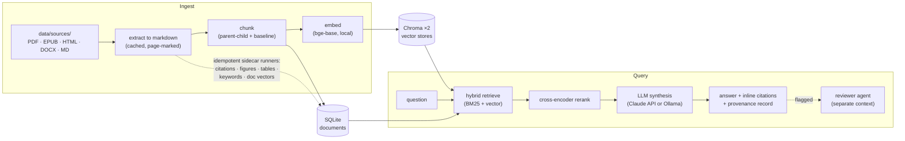

# Document Assistant

A local-first RAG assistant over your own document corpus (PDF, EPUB, HTML, DOCX, Markdown) that answers questions with inline, page-level citations — and measures whether those answers are any good. Document-format-agnostic by design; the test corpus here is research papers because they're real and freely available, but nothing assumes academia.

Not a chatbot wrapper. A fluent answer with a confident citation is not the same as a correct one, so this system is built to *prove* its answers rather than just emit them: page-level citations you can click through, a provenance record on every response, and a separate reviewer that can re-grade a flagged answer. You can even disable LLM generation entirely and rely on the retrieval layer alone. It implements established RAG techniques rather than new algorithms — what it contributes is the integrity layer and the measurement behind it.

## Engineering highlights

- **Settings are locked by experiment, not intuition.** TOP_K, parent-child retrieval, chunk sizes, and the BM25/vector mix were each picked by measuring alternatives with the in-repo eval harness. The reasoning behind each non-obvious choice — and what didn't make the cut — is in [`docs/decisions.md`](docs/decisions.md).
- **Benchmarks anyone can re-run.** The public eval set runs over a corpus rebuilt from arXiv — 5 trials, reported as mean ± trial-mean std, caveats stated alongside (see [Benchmarks](#benchmarks)). What each scorer measures and why: [`tests/eval/TESTING.md`](tests/eval/TESTING.md).
- **A research-integrity layer.** Every answer carries a provenance record (retrieved chunks, model, cost); a separate-context reviewer agent re-grades flagged answers; confidence signals keep the UI quiet on clean ones — AI-assisted output that stays auditable.
- **Growth by addition.** Derived data (citations, figures, tables, keywords, doc vectors, the wiki) ships as sidecar modules with idempotent CLI runners that never mutate the chunk store — new capability is a new module, not a rewrite.
- **A local RAG sandbox.** The embedder, chunking, the retrieval candidate pool (`CANDIDATE_K`) and final cut (`TOP_K`), parent-child retrieval, and the LLM backend (Claude API or local Ollama) are config-swappable, with the eval harness on hand to measure what each change does.

## What it does

- **Grounded answers with inline citations** — page numbers and sections, every passage inspectable.
- **Evidence vs. interpretation** — each answer separates what your sources actually say from the AI's synthesis (clearly labelled, with per-claim grounding markers you can accept / reject / edit), so an inference is never mistaken for a fact. See [how answers work](docs/how-answers-work.md).
- **Hybrid retrieval + reranking** — BM25 + vector ensemble, cross-encoder reranker, parent-child chunks.
- **Citation graph** — extracts references, resolves them against your library, exposes in/out edges.
- **Corpus wiki** — derived, linked, cited topic notes synthesized over the corpus; regenerable, never hand-authored.
- **Measurable quality** — eval harness with six scorers (deterministic + LLM judge) and a DuckDB result store.
- **Local-first and pluggable** — Chroma + SQLite on disk; Claude API or local Ollama.
- **Cost transparency** — per-turn and per-session token tracking.

## Architecture



The chunk store is never mutated after ingest — every derived layer (citations, figures, tables,
keywords, the wiki, the concept graph) is an additive sidecar with an idempotent CLI runner
([`docs/architecture.md`](docs/architecture.md)).

## Stack

| Component | Choice |
|---|---|
| Embeddings | `bge-base-en-v1.5` (default, swappable via `EMBEDDING_MODEL`; `specter2` also registered) |
| Reranker | `bge-reranker-base` (local) |
| Vector store | Chroma (local, persistent) |
| Keyword search | BM25 |
| LLM | Claude (API) or Llama 3 / Mistral (local via Ollama) |
| Orchestration | LangChain |
| Document store | SQLite (via SQLAlchemy) |
| UI | Tauri desktop app (Svelte 5 + Vite over a FastAPI/SSE backend) + CLI |
| PDF / table extraction | PyMuPDF4LLM (full-text, default); Marker for high-fidelity tables, run isolated out-of-process on caption-detected table pages (chosen by measurement) — a separate idempotent post-ingest pass; tables enter retrieval on the next ingest |

## Setup

```bash
# Prerequisites: Python 3.12, uv
# Note: use Python 3.12 — 3.14 is not yet supported at runtime (some native
# dependencies aren't cp314-stable; see .claude/KNOWN_ISSUES.md KI-2).
git clone <your-repo-url> doc-assistant
cd doc-assistant

# Pick ONE torch backend extra for your machine (they are mutually exclusive):
uv sync --extra cu130   # NVIDIA GPU box (CUDA) — GPU-accelerated embedder + reranker
# uv sync --extra cpu   # CPU-only box (and CI) — the +cu130 wheel SEGFAULTS without a usable GPU
# add `--extra dev` for the test/lint toolchain, e.g.  uv sync --extra cu130 --extra dev
# on the GPU box, prefix run commands too, e.g.        uv run --extra cu130 python -m doc_assistant.ingest

# Configure
cp .env.example .env   # then fill in your API key
```

> **Why an `--extra`?** uv's `torch-backend` auto-detect is `uv pip`-only (a no-op for
> `uv lock`/`uv sync`/`uv run`), and two same-OS machines can't be distinguished by a lock
> marker — so the torch variant is chosen per machine by a mutually-exclusive extra
> (`cpu` vs `cu130`). Full rationale: [`docs/specs/torch-backend-per-machine.md`](docs/specs/torch-backend-per-machine.md).

> **Hardware — a GPU is strongly recommended.** The embedder (`bge-base`) and the cross-encoder
> reranker run **locally** on every ingest and query, so they benefit a lot from GPU acceleration.
> Install the matching torch extra (Setup above: `--extra cu130` for NVIDIA, `--extra cpu` otherwise);
> `sentence-transformers` then auto-selects the device at runtime (CUDA → MPS → CPU):
>
> - **NVIDIA / CUDA** — `uv sync --extra cu130`. Best supported and the only path benchmarked here:
>   retrieve + rerank ~70 ms on an RTX 4070. Recommended.
> - **Apple Silicon (M-series)** — PyTorch's MPS (Metal) backend is auto-detected, so the embedder
>   and reranker use the Mac's GPU with no config change. Faster than CPU, though generally slower
>   than a discrete CUDA card and **not benchmarked here** (MPS also occasionally falls back to CPU
>   for unsupported ops).
> - **CPU-only** — `uv sync --extra cpu` (Linux and CI too). Works, so a GPU isn't required — but the
>   same step is seconds per query, and re-embedding a corpus (ingest / `--rebuild` / the chunking
>   sweep) is dramatically slower.
>
> (The chat LLM is separate — Claude API or local Ollama — so this is about the local embedder +
> reranker, not the generation model. For local-LLM hardware, see
> [System requirements](#system-requirements).)

> **Windows troubleshooting — SSL crash on `uv`-managed Python.** On some Windows machines the
> app dies instantly with no traceback (`OPENSSL_Uplink(...): no OPENSSL_Applink`) the first time it
> opens an HTTPS connection — a Claude API call, Ollama, or any networked test. The cause is the
> OpenSSL in uv's bundled (python-build-standalone) interpreter; an official CPython is unaffected.
> Fix by rebuilding the venv on an official Python 3.12:
> ```bash
> py install 3.12                                                   # official python.org build
> uv venv --clear --python "$(py -3.12 -c 'import sys;print(sys.executable)')"
> uv sync --all-extras
> ```
> (Behind a TLS-inspecting proxy, prefix uv commands with `UV_NATIVE_TLS=1` so uv trusts the
> Windows certificate store.) Offline work — ingest, embeddings, retrieval — is unaffected either way.

## Usage

```bash
# Drop your documents in data/sources/
mkdir -p data/sources
cp ~/your-papers/*.pdf data/sources/

# Build the index (one-time, then incremental)
uv run python -m doc_assistant.ingest

# Launch the desktop app (Tauri + Svelte over the FastAPI backend)
just api                                        # backend on 127.0.0.1:8001
cd apps/desktop && npm install && npm run dev    # dev UI (or: npx tauri dev for a native window)

# Or use the CLI
uv run python apps/cli.py
```

To rebuild from scratch (after changing chunking strategy, for example):

```bash
uv run python -m doc_assistant.ingest --rebuild
```

### Move your library between machines

`data/sources/` is gitignored (your library is yours), so cloning the repo elsewhere doesn't carry your documents. Keep a small **sources manifest** — the private analog of the public-corpus downloader — to reconstitute them:

```bash
uv run python -m scripts.sync_sources               # record data/sources/ -> data/sources_manifest.yaml
# fill in the `url:` for any file not auto-matched, then copy the manifest to the other machine out-of-band
uv run python -m scripts.sync_sources --download    # on the other machine: re-fetch into data/sources/
uv run python -m scripts.sync_sources --verify-only # checksum what's on disk against the manifest
```

The manifest pins each file by SHA-256 + size plus the URL it came from; files matching the public corpus get their URL filled in automatically. It's **gitignored** — share it out-of-band, never commit it (the repo is public).

### Citation graph + similarity edges (Phase 4)

After ingestion, three post-passes populate the data layer:

```bash
# Pull title / authors / year / DOI off each document header
uv run python -m scripts.extract_doc_metadata --apply

# Parse References sections, match to library docs, persist edges
uv run python -m scripts.extract_citations --apply

# Mean-pool chunk embeddings -> doc vectors -> top-K cosine similarity edges
uv run python -m scripts.compute_doc_vectors --apply
```

All three are idempotent. `extract_*` accept `--doc <hash-prefix>` to scope;
`compute_doc_vectors` accepts `--top-k`, `--threshold`, and `--force`.

From the chat UI or CLI:

```
/library                  show all documents (use first 8 chars of ID below)
/document <doc-id>        full details for one document
/cites <doc-id>           papers this document cites (internal + external)
/cited-by <doc-id>        library documents that cite this one
/graph <doc-id>           Mermaid subgraph of internal citation edges
/similar <doc-id>         top-N semantically-similar documents
/bibtex                   render the whole library as BibTeX
```

Also available as CLI utilities:

```bash
uv run python -m scripts.find_duplicates    # byte + content dedup report; never deletes
uv run python -m scripts.export_bibtex      # write docs/library.bib
```

## Project layout

```
src/doc_assistant/    # core library (pipeline, ingestion, extractors, health, library)
apps/                 # UIs — thin shells, no business logic
scripts/              # maintenance utilities (hash migration, sync verification)
tests/                # unit, integration, eval harness
docs/                 # architecture and design decisions
data/                 # runtime data (sources, caches, vector stores, SQLite) — not committed
```

See [`docs/architecture.md`](docs/architecture.md) for the data flow and module contracts, and [`docs/decisions.md`](docs/decisions.md) for the reasoning behind key design choices.

## Running tests

```bash
# Unit + integration (free, fast)
uv run pytest tests/unit/ tests/integration/

# With coverage
uv run pytest tests/unit/ tests/integration/ --cov=src --cov-report=term-missing

# Evaluation harness — free deterministic scorers
uv run python -m scripts.run_eval

# With LLM judge (Claude Haiku, ~$0.10 for 35 cases)
uv run python -m scripts.run_eval --with-llm-judge

# Public eval — 10 cases on the RAG-literature demo corpus (see Reproducing)
uv run python -m scripts.download_corpus           # fetches 10 papers from arXiv
uv run python -m doc_assistant.ingest
uv run python -m scripts.run_eval --cases tests/eval/cases.public.yaml --with-llm-judge
```

## Docker

```bash
cp .env.example .env             # fill in your API key
mkdir -p data/sources && cp ~/your-papers/*.pdf data/sources/

docker compose build
docker compose run --rm doc-assistant python -m doc_assistant.ingest
docker compose up
```

The container serves the **headless FastAPI backend** on `http://localhost:8001` (check `http://localhost:8001/api/health`) — the same backend the desktop app's sidecar bundles. The GUI is the Tauri desktop app, which runs on the host (see Usage), not in the container; Docker is for running the API/server. Point a client (or the desktop app's backend URL) at `:8001`.

For local LLM via Ollama, set `LLM_MODE=local` in `.env`. On Linux, ensure Ollama listens on all interfaces: `OLLAMA_HOST=0.0.0.0 ollama serve`.

```bash
docker compose down            # stop, keep data
docker compose down -v         # stop, delete model cache volume
```

## Benchmarks

Quality is measured, not asserted. The eval harness ([`src/doc_assistant/eval/`](src/doc_assistant/eval/)) runs the full RAG pipeline — retrieve, rerank, generate — over a fixed question set and scores each answer on retrieval and answer-quality signals. The full strategy (test tiers, what each scorer measures and why, the reproducibility stance) is documented in **[`tests/eval/TESTING.md`](tests/eval/TESTING.md)**.

The headline benchmark is **reproducible by anyone**: a public demo corpus of the 10 arXiv papers behind this project's own methods (RAG, dense retrieval, sentence embeddings, the BGE and SPECTER2 embedders, BERT re-ranking, ColBERT, HyDE, LLM-as-a-judge, AI Usage Cards). Nothing is re-hosted — [`corpus_manifest.yaml`](tests/eval/corpus_manifest.yaml) pins each paper's arXiv ID + SHA-256 and a script fetches the PDFs.

5 trials on `bge-base` (`--repeat 5`), reported as mean ± trial-mean std:

| Scorer | Mean (n=5) | Trial-mean std | What it measures |
|---|---:|---:|---|
| `citation_overlap` (0-1) | **1.000** | 0.000 | retrieval cited the correct source |
| `contains_all` (0-1) | **0.927** | 0.034 | answer surfaces the required facts |
| `llm_judge` (1-5) | **3.894** | 0.075 | reference-graded answer quality |

`citation_overlap` is **1.000 with zero variance** — retrieval depends only on the deterministic index, so it cites the right paper in all 10 cases, every trial. `contains_all` scores the stochastic generated answer, so single runs wobble (0.88–0.98) around a stable 0.927 mean. `llm_judge` **3.894/5** suggests the answers hold up — the `contains_all` shortfall looks more like phrasing than missing content. Cases are deliberately strict, not tuned to score 1.0. Committed reference results live in [`tests/eval/baselines/`](tests/eval/baselines/).

One honest caveat: the judge call on `sbert_motivation` is flaky — skipped in 3 of 5 trials (API timeout / JSON parse), so the `llm_judge` mean is over 47 of 50 scores.

### Embedder comparison — `bge-base` vs `specter2`

`bge-base` is the default because it performed better here — though the better embedder
depends on the corpus and the setup (these runs index full-document markdown chunks,
not just abstracts). `specter2` is tuned for scientific papers, which the public corpus
is, so it seemed worth a look. Same corpus, `--repeat 5`:

| Scorer | `bge-base` | `specter2` |
|---|---:|---:|
| `citation_overlap` | 1.000 ± 0.000 | 0.900 ± 0.000 |
| `contains_all` | 0.927 ± 0.027 | 0.800 ± 0.031 |
| `llm_judge` | 3.738 ± 0.093 | 3.447 ± 0.090 |

Reproduce the `specter2` arm (the `bge-base` arm is the default run):

```bash
EMBEDDING_MODEL=specter2 uv run python -m doc_assistant.ingest
EMBEDDING_MODEL=specter2 uv run python -m scripts.run_eval \
    --cases tests/eval/cases.public.yaml --with-llm-judge --repeat 5
```

Numbers + run ids: [`tests/eval/baselines/bge_vs_specter2_public_2026-06-04.md`](tests/eval/baselines/bge_vs_specter2_public_2026-06-04.md).

### Chunk sizes

The parent/child chunk sizes are the locked default `2000/200 · 400/50`. A 6-config sweep on
the public corpus (`--repeat 3`, with judge) checked whether any alternative beats them —
**none does**: the default is tied-best on `contains_all` (0.933) and best on `llm_judge`
(3.951), and `citation_overlap` saturates at 1.000 across every config. A larger parent
(3000/300) was weakest on the judge; a smaller `256/32` child matched the default with lower
variance but didn't exceed it. So the defaults stand on measurement, not assumption. Full grid
+ run ids: [`tests/eval/baselines/chunking_sweep_public_2026-06-06.md`](tests/eval/baselines/chunking_sweep_public_2026-06-06.md).

### BM25 / vector mix

The hybrid split `BM25 0.4 / vector 0.6` was the last locked retrieval setting never measured. A
full sweep of the BM25 arm's weight (`0.0`→`1.0`) settles it: **post-rerank recall is flat across the
entire range** — no weight beats the default, which stays `0.4/0.6`. The result is structural, not
just an artefact of one corpus: the ensemble hands the cross-encoder the *whole* candidate pool from
both arms, so the reranker re-scores everything and the weight only reorders candidates it then
re-sorts — the final top-K doesn't move. (The *pre*-rerank candidate order *does* shift with the
weight, which is how the measurement is shown to discriminate — a flat curve from a live knob, not a
dead one.) Full method, the structural explanation, and when the weight *would* matter:
[`tests/eval/baselines/bm25_weight_sweep_2026-07-03.md`](tests/eval/baselines/bm25_weight_sweep_2026-07-03.md).

### Reproducing

[`tests/eval/corpus_manifest.yaml`](tests/eval/corpus_manifest.yaml) lists the 10 papers (pinned arXiv versions + SHA-256); `download_corpus.py` fetches them from arXiv (download-only, so arXiv's license is not an issue). [`tests/eval/cases.public.yaml`](tests/eval/cases.public.yaml) is a standalone 10-case set written against them.

```bash
uv run python -m scripts.download_corpus            # 10 PDFs from arXiv -> data/sources/
uv run python -m scripts.download_corpus --verify-only  # checksum against the manifest
uv run python -m doc_assistant.ingest
uv run python -m scripts.run_eval --cases tests/eval/cases.public.yaml --with-llm-judge
```

`--with-llm-judge` adds the reference-graded answer-quality score (Claude Haiku); it needs an `ANTHROPIC_API_KEY` in `.env` and costs a few cents for 10 cases. Drop the flag for a free, deterministic-only run (retrieval + keyword scorers).

**Where runs are stored.** Every `run_eval` invocation appends to `data/eval.duckdb` — a binary working log, **gitignored** and regenerated on first run, not a source artifact. Committed, human-readable reference results live in [`tests/eval/baselines/`](tests/eval/baselines/) — diff a new run against those, not the binary DB. The harness is structured for extraction: every file except `adapters.py` is project-agnostic and can be lifted into a standalone repo.

**Chunking sweep** (re-embeds the corpus per config — slow; GPU recommended) — the result is
under [Chunk sizes](#chunk-sizes) above; this reproduces it:

```bash
uv run python -m scripts.sweep_chunking --dry-run            # print the grid + commands
uv run python -m scripts.sweep_chunking --cases tests/eval/cases.public.yaml --repeat 3 --with-llm-judge
```

**BM25 / vector weight sweep** (retrieval-only — free, deterministic, no re-embed) — the result is
under **BM25 / vector mix** above:

```bash
uv run python -m scripts.sweep_bm25_weight --dry-run                              # print the grid
uv run python -m scripts.sweep_bm25_weight --cases tests/eval/cases.public.yaml   # sweep on the public corpus
# or gate a single weight through the full harness:
uv run python -m scripts.run_eval --cases tests/eval/cases.public.yaml --bm25-weight 0.5 --with-llm-judge
```

## Status

**Phase 6 + 7 in progress (as of 2026-07-02).** Shipped: core RAG (Phase 1); measured quality + eval harness (Phases 2 & 5); document store + library UI (Phase 3); citation graph + doc-similarity edges (Phase 4); the research-integrity layer — provenance card, heuristic confidence signals, and a separate-context LLM reviewer agent; and a provider-agnostic LLM layer (Claude API *or* fully-local Ollama for analysis, reviewer, and judge). **712 tests · ruff / mypy --strict / bandit clean.**

`bge-base` is the default embedder — it performed better in our comparisons, though the better choice depends on the corpus ([`docs/decisions.md`](docs/decisions.md) → Phase 5 / Feature 3; re-checked on the public corpus, see [Benchmarks](#benchmarks)).

**Recently shipped:** Marker table extraction (isolated out-of-process sidecar, gated to caption-detected table pages — engine chosen by measurement), dual-layer evidence/interpretation answers, the provider-agnostic LLM layer ([`docs/specs/llm-provider-isolation.md`](docs/specs/llm-provider-isolation.md)), figure region detection + VLM description (Feature 4b/4c), the knowledge-currency layer ([`docs/specs/feature-7d-knowledge-currency.md`](docs/specs/feature-7d-knowledge-currency.md)), the Tauri desktop shell that replaced Chainlit (ADR-002, M0–M5), a zero-LLM corpus keyword extractor with contrastive termhood scoring ([`ADR-006`](docs/decisions/ADR-006-contrastive-keyword-termhood.md): C-value × reference-corpus weirdness via [`wordfreq`](https://github.com/rspeer/wordfreq)), and the deterministic concept-graph skeleton ([`docs/archive/concept-graph-redesign.md`](docs/archive/concept-graph-redesign.md), Node A — built; its threshold-setting validation run is still pending, so the graph is not yet marked usable). **Next:** the gap-detection layer ([`docs/decisions/ADR-004-gap-detection-layer.md`](docs/decisions/ADR-004-gap-detection-layer.md) · [`docs/specs/feature-gap-detection.md`](docs/specs/feature-gap-detection.md)) — designed, blocked on that validation run (RG-001) — and user-selective ingestion ([`docs/specs/feature-selective-ingestion.md`](docs/specs/feature-selective-ingestion.md), drafted). Full rationale and roadmap: [`docs/decisions.md`](docs/decisions.md), [`docs/ROADMAP.md`](docs/ROADMAP.md).

A 60-second walkthrough for first-time readers: [`docs/DEMO.md`](docs/DEMO.md).

---

## System requirements

Two workloads can run on your machine: the **retrieval models** — the `bge-base` embedder and the
cross-encoder reranker — **always** run locally (see the [hardware note](#setup) in Setup), and the
**chat LLM** runs locally too *if* you choose [Ollama](https://ollama.com) instead of the Claude API.
With the default API path, only the retrieval models run on your hardware.

If you go fully local, here's the spec for the LLM side, game-spec style. doc_assistant's local
default is an 8B model (e.g. `llama3.1:8b`, 4-bit quantized):

| Local LLM (Ollama) | Minimum — runs, slow | Recommended — smooth |
|---|---|---|
| Compute | x86-64 CPU only | NVIDIA GPU (CUDA, compute capability ≥ 5.0), AMD ROCm, or Apple Silicon (Metal) |
| VRAM | — (CPU inference) | ≥ 8 GB (an 8B 4-bit model ≈ 5–6 GB) |
| System RAM | 8 GB | 16 GB |
| Free disk | ~6 GB (8B weights) | ~10 GB+ |

Bigger models scale up — Ollama's rough rule of thumb is **~8 GB RAM per 7–8B, 16 GB per 13B, 32 GB
per 33B** (a quantized model that fits entirely in VRAM runs far faster than one spilling to RAM/CPU).
For the authoritative, current GPU list — NVIDIA compute capability, AMD ROCm cards, Apple Metal — see
**Ollama's GPU docs: <https://docs.ollama.com/gpu>**.

> **Both at once?** On a single 12 GB consumer card (the RTX 4070 used here), the embedder + reranker
> (~1.5 GB) and an 8B 4-bit model (~6 GB) coexist comfortably — so the whole pipeline, retrieval *and*
> generation, runs on one GPU with no cloud calls.

---

## License

Apache-2.0 — see [LICENSE.txt](LICENSE.txt).
