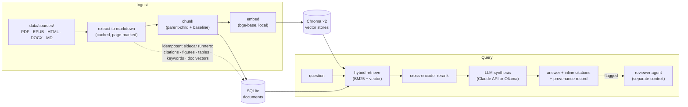

# Provenote

A local-first research assistant that answers questions about **your own documents** (PDF, EPUB,
HTML, DOCX, Markdown) with inline, page-level citations, and measures whether those answers are any
good. Hybrid retrieval (BM25 + vector + cross-encoder rerank) over Chroma and SQLite on your disk;
Claude API or fully-local Ollama for generation.

A fluent answer with a confident citation is not the same as a correct one. So every answer carries a
provenance record, separates what your sources *say* from what the model *infers*, and can be
re-graded by a separate reviewer. The RAG techniques here are established ones; what this adds is the
integrity layer and the measurement behind it.


## Why it's built this way

- **Settings were chosen by experiment.** `TOP_K`, parent-child retrieval, chunk sizes and the
  BM25/vector mix were each picked by measuring alternatives with the in-repo eval harness. What
  didn't make the cut is recorded too, in [`docs/decisions.md`](docs/decisions.md).
- **Benchmarks anyone can re-run.** The headline numbers come from a public corpus pinned by arXiv ID
  and SHA-256, fetched by a script, reported with variance and caveats ([`evals/`](evals/README.md)).
- **Growth by addition.** Every derived layer (citations, figures, tables, keywords, wiki, concept
  graph) is an idempotent sidecar that never mutates the chunk store. A new capability is a new
  module.

## What it does

- **Grounded answers with inline citations.** Page numbers and sections, every passage inspectable.
- **The page behind a citation.** A citation can open the page it came from, rendered as it was
  printed, in a pane next to the document's library entry. It can also show the passage *in
  context*, highlighted inside the surrounding text with how far through the document it sits.
- **Evidence vs. interpretation.** Each answer separates what your sources say from the model's
  synthesis, with per-claim grounding markers you can accept, reject or edit, so an inference is
  never mistaken for a fact ([how answers work](docs/how-answers-work.md)).
- **Citation and concept graphs.** Resolved reference edges, plus a deterministic concept skeleton
  (the LLM only annotates existing edges, it never invents structure) with gap detection that
  surfaces single-source concepts and thin bridges as leads to read next. The graph says how many
  of your documents it covers, and a concept joins it from **Manage keywords**, inside the app.
- **Knowledge-currency markers, currently opt-in.** Advisory `contested` and `superseded trend`
  chips derived from cross-document stance and publication years. They never block anything, and
  they ship **off** (`EPISTEMICS_MARKERS_ENABLED=true` enables them) because the stance pass behind
  them judges without seeing the document text; see Limitations.
- **Library workspace.** Browsable grid with filters and folders; each document opens as five
  ordered blocks — metadata, connections, passages, figures, references — with the full
  bibliography and the figures extracted from the paper, readable at full size. Editable metadata
  that survives re-ingest, safe delete (OS trash first), selective ingestion, derived corpus wiki.
- **Add documents from inside the app.** Drop files or a folder onto the window, pick them, or
  import from Zotero. A review sheet says what will happen to each file before anything is copied
  or indexed, and every addition is a choice between *copy it in* and *reference it where it is*; a
  referenced file is never moved, altered or deleted. One part of reading a document (metadata,
  figures, references, text) can be re-run on its own, for one document or a selection, with its
  cost stated first.
- **A chat history you can keep tidy.** Conversations are searchable and renameable, exportable as
  one markdown file, and removable in bulk — a soft delete that the same control undoes.
- **Measurable quality.** Eval harness with six scorers (deterministic plus LLM judge), DuckDB result
  store, per-turn cost tracking.

## Architecture


```mermaid
flowchart LR
    subgraph Ingest
        A["data/sources/<br/>PDF · EPUB · HTML · DOCX · MD"] --> B["extract to markdown<br/>(cached, page-marked)"]
        B --> C["chunk<br/>(parent-child + baseline)"]
        C --> D["embed<br/>(bge-base, local)"]
    end
    D --> E[("Chroma ×2<br/>vector stores")]
    C --> F[("SQLite<br/>documents")]
    B -. "idempotent sidecar runners:<br/>citations · figures · tables ·<br/>keywords · doc vectors" .-> F
    subgraph Query
        Q["question"] --> R["hybrid retrieve<br/>(BM25 + vector)"]
        R --> RR["cross-encoder rerank"]
        RR --> G["LLM synthesis<br/>(Claude API or Ollama)"]
        G --> H["answer + inline citations<br/>+ provenance record"]
        H -. "flagged" .-> V["reviewer agent<br/>(separate context)"]
    end
    E --> R
    F --> R
```

`bge-base-en-v1.5` embedder and `bge-reranker-base` cross-encoder, both local and swappable; Chroma
for vectors, SQLite for documents; Tauri + Svelte 5 desktop app over a FastAPI/SSE backend, plus a
CLI. Data flow and module contracts: [`docs/architecture.md`](docs/architecture.md).

## Benchmarks

The numbers below come from the eval harness, which runs the full pipeline (retrieve, rerank,
generate) over a fixed question set on a public 10-paper arXiv corpus that anyone can rebuild.
5 trials on `bge-base`, latest run 2026-08-01, reported as mean ± trial-mean std:

| Scorer | Mean (n=5) | Trial-mean std | What it measures |
|---|---:|---:|---|
| `citation_overlap` (0-1) | **1.000** | 0.000 | retrieval cited the correct source |
| `contains_all` (0-1) | **0.932** | 0.014 | answer surfaces the required facts |
| `llm_judge` (1-5) | **3.694** | 0.258 | reference-graded answer quality |

`citation_overlap` is 1.000 with zero variance because retrieval depends only on the deterministic
index; the generated-answer scorers wobble run-to-run around stable means. The cases are strict,
and none were tuned to score 1.0. Two caveats travel with these numbers: `citation_overlap` is
saturated on a 10-paper corpus, so it shows *no regression at the available resolution* rather than
ranking quality — on the 97-document library the same scorer spans 0.877-0.946 and does
discriminate; and this run's `llm_judge` band is wide enough that only changes larger than about
±0.5 would be visible. Full results, including the embedder comparison, the chunk-size sweep, the
weight sweep and reproduction steps, live in [`evals/`](evals/README.md).

Cost is measured separately from quality: launch and per-turn latency, ingest throughput, memory,
disk, and what each of those does as the corpus grows are in
[`docs/performance.md`](docs/performance.md).

### How long does indexing take?

These are estimates; the real number depends on your machine and your documents. What is stable
is the **shape**: which part of the work costs what. Measured on a 97-document library (2,859
pages) on a 28-core desktop with a GPU.

| Your document | First index | Re-opening it later |
|---|---|---|
| A 30-page paper with selectable text | **~15 seconds** | instant — the result is cached |
| The same paper, if it needs OCR | **~35 seconds** | instant |
| A 300-page scanned book | **several minutes**, nearly all OCR | instant |
| A `.txt` or `.md` file | **milliseconds** — no extraction needed | instant |

The two OCR rows apply only when an OCR engine (`tesseract`) is on your PATH: the app and the
installer ship none, and without one a scanned page yields nothing (see Limitations).

**Estimate by page count, not file size.** Measured on this corpus, a 15 MB / 20-page paper indexed
*faster* than a 5 MB / 22-page one. File size is a poor predictor of indexing time; page count is
a good one.

**Where the time actually goes**, for a typical paper:

| | share |
|---|---:|
| Reading the PDF and turning it into text | **~90%** |
| Building the search index (embedding) | ~5% |
| Everything else — figures, citations, keywords, metadata | ~5% combined |

That first row is why indexing feels slow, and it is why the app only does it **once per
document**: the result is cached, so re-opening, re-searching and even re-indexing an unchanged
library are effectively free. Adding one paper to a large library costs one paper's worth of work.

**Indexing does not take over your computer.** By default Provenote extracts two documents at a
time, which measured **1.47x faster** than one-at-a-time while leaving the rest of your machine
alone. More workers help little: 14 of them reached only 1.74x, so the default gives up very
little speed. You can change it (`--workers off | light | balanced | full`), and even `full`
leaves half your cores free.

## Quick start

**Windows installer:** download `Provenote_<version>_x64-setup.exe` from the
[latest release](https://github.com/ldele/doc_assistant/releases/latest) and run it. It is not
code-signed, so SmartScreen will warn. It is a ~1.6 GB download because the embedding and
re-ranking models are bundled, and it runs fully offline with a local [Ollama](https://ollama.com).
Settings → Updates can tell you when a newer one is published; it never installs anything for you.

**From source:**

```bash
uv sync --extra cu130 --extra dev        # or --extra cpu on a GPU-less box
uv run python -m scripts.download_corpus --demo   # no corpus yet? 28 papers from arXiv
uv run python -m doc_assistant.ingest
just app                                 # backend + desktop UI
```

Then open **Settings → Getting started** and pick an answer engine: paste an Anthropic API key
(checked before it is saved, stored on your machine only) or point at a local
[Ollama](https://ollama.com) server for a free, fully offline run. Both paths are configurable
in-app, so there is no file to edit; `.env` still works and takes precedence if you prefer it.

First run, step by step: [`docs/QUICKSTART.md`](docs/QUICKSTART.md).
Full install, hardware guidance and Docker: [`docs/setup.md`](docs/setup.md).
Everyday commands, enrichment passes and tests: [`docs/usage.md`](docs/usage.md).

## Limitations

Re-read for this release; the full ledger lives in `.claude/KNOWN_ISSUES.md`.

- **An API key entered in the app is stored in plain text** in your data folder — weaker than an OS
  keychain, which is the recorded upgrade path
  ([ADR-034](docs/decisions/ADR-034-in-app-provider-setup.md)). Use `.env`, which takes precedence,
  if you would rather manage the key yourself.

- **Scanned PDFs are only read if your machine happens to have an OCR engine, and the app ships
  none.** A PDF that is pure page images extracts to nothing and is marked *broken*. But if a
  `tesseract` binary is on your PATH, the PDF reader finds it by itself and reads the pages — and
  nothing in the app asks for this or reports it. The same scan produced 0 characters on one date
  and 34,600 on another, on the same machine, with nothing in the app changed; two machines on the
  same version can build different libraries from the same file, and the extraction cache keeps
  whichever result came first (KI-47). Deliberate, opt-in OCR whose output is marked as such is
  designed and not built ([ADR-039](docs/decisions/ADR-039-ocr-sidecar-for-scanned-pdfs.md)). One
  document of 97 in the development library is a pure scan.

- **A reference links to a paper in your library only when the titles agree, and the links are
  worked out once.** A document's bibliography is shown in full; a reference becomes a link only on
  an exact DOI or an agreeing title, because surname-plus-year alone was wrong 13 times in 16 on the
  development library (now 41 links, the 12 false ones gone, the rest checked by hand). Links are
  computed when a document is first read and not revisited: adding the paper a reference points at
  does not turn it into a link until the citing document is read again. A command-line pass
  (`scripts.extract_citations --reresolve`) refreshes them without re-reading anything; it is not
  yet a button.

- **Validated at ~100 documents, not yet at thousands.** Retrieval quality is benchmarked and holds.
  Memory used to be the limit and no longer is: both search indexes now live on disk, so backend RAM
  measures flat at about 2 GB regardless of corpus size
  ([ADR-036](docs/decisions/ADR-036-sparse-index-on-disk.md)). What binds now is the first ingest,
  which is dominated by PDF extraction at roughly 15 seconds per document — two documents at a time
  by default, see above — and disk at about 6 MB per document. Numbers and projections:
  [`docs/performance.md`](docs/performance.md).
  The *enrichment* layer still has its own corpus-linear hot paths and corpus-tuned thresholds,
  catalogued with a prioritized fix plan in the
  [scale review](docs/archive/local/REVIEW_2026-07-19_scale-robustness.md), so don't bulk-ingest thousands of
  documents before those land.
- **Local models cite less, and the gap is measured.** Across 27 questions on a 97-document
  library, with the same prompt and retrieval, `llama3.1:8b` carried inline citations on 36% of its
  sentences and `qwen2.5:7b` on 14%, against 81% for Claude Haiku. Answers stay grounded either
  way; more claims simply show as *uncited*. Small local models also place documents into a
  taxonomy at 70-87% precision, and their self-reported confidence carries almost no signal; on one
  model it was *anti*-correlated with correctness, so do not auto-accept on it. The app states this
  where you choose the engine, and blocks nothing.
- **Document metadata extraction is imperfect.** A handful of documents still yield no title, or
  publisher furniture instead of one, and downstream layers that key on the title inherit that —
  the reference-link limitation above is the visible consequence.
- **Per-source "epistemic assessment" is off by default.** The chips labelling a source *contested*
  / *corroborated* / *single-source* are withheld: they came from a stance pass that judges without
  ever seeing the document text and whose verdict moves with list position (one document, identical
  inputs, position varied alone → four different verdicts). Nothing was deleted —
  `EPISTEMICS_MARKERS_ENABLED=true` opts back in — and the rebuild is planned. Document year,
  relevance score and graph freshness are unaffected and still shown.
- **Single-user, local-first by design.** The FastAPI backend serves one desktop app on localhost;
  multi-client serving would need threadpool offloading (documented, not built).
- **Tested primarily on Windows** plus CI on Linux; macOS (MPS) paths work but are unbenchmarked.

## Status

**v0.6.0 (2026-09-01) — a citation now opens its page.** Phase 6 + 7 in progress. Shipped:
core RAG, the eval harness, the document store and library workspace, a source pane that opens a
citation at its page, adding documents from inside the app (dropped, picked or imported from
Zotero; copied in or referenced in place), per-part re-ingest, citation and doc-similarity graphs,
the research-integrity layer (provenance, evidence/interpretation split, separate-context
reviewer), a provider-agnostic LLM layer with in-app setup and live switching between Claude API
and local Ollama, figures and tables, the corpus wiki, and the concept-graph stack with gap
detection and a stated coverage. **2,389 tests · ruff / mypy / bandit clean.** The Windows
installer on the [releases page](https://github.com/ldele/doc_assistant/releases) is built from
the tag and installed on a clean machine before it is published.

Next: marking the cited passage on the page image itself (measured viable, ROADMAP row 24). Still
open: the extracted keyword layer is measured and does not partition a corpus (97% of keywords on
a single document). Release notes: [`CHANGELOG.md`](CHANGELOG.md). Full roadmap:
[`docs/ROADMAP.md`](docs/ROADMAP.md).

## Documentation

| | |
|---|---|
| [Quickstart](docs/QUICKSTART.md) | First run in ~10 minutes: API key or Ollama, then your documents |
| [60-second walkthrough](docs/DEMO.md) | What to look at first |
| [Setup](docs/setup.md) · [Usage](docs/usage.md) | Install, hardware, Docker · commands, enrichment, tests |
| [Architecture](docs/architecture.md) | Data flow and module contracts |
| [Decisions](docs/decisions.md) | ADR index, and why each non-obvious choice was made |
| [How answers work](docs/how-answers-work.md) | Evidence/interpretation split, grounding markers |
| [Evals](evals/README.md) | Quality benchmark write-ups and reproduction |
| [Performance](docs/performance.md) | Speed, memory, disk, the trade each optimisation made, and what happens at 10x |

Agent-facing coordination lives in `AGENTS.md`, kept separate from this README.

## License

Apache-2.0, see [LICENSE.txt](LICENSE.txt).
