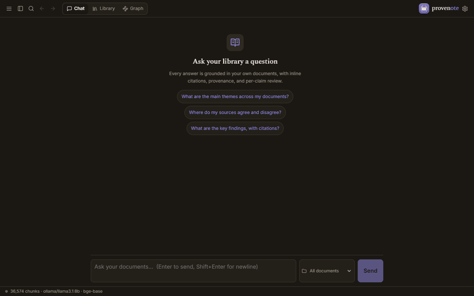
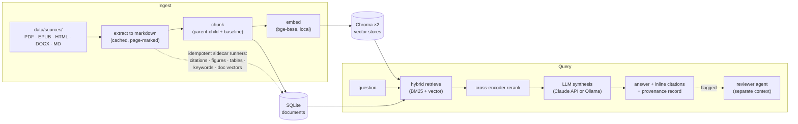

# Provenote

A local-first research assistant that answers questions about **your own documents** (PDF, EPUB,
HTML, DOCX, Markdown) with inline, page-level citations, and measures whether those answers are any
good. Hybrid retrieval (BM25 + vector + cross-encoder rerank) over Chroma and SQLite on your disk;
Claude API or fully-local Ollama for generation.

A fluent answer with a confident citation is not the same as a correct one. So every answer carries a
provenance record, separates what your sources *say* from what the model *infers*, and can be
re-graded by a separate reviewer. The RAG techniques here are established ones; what this adds is the
integrity layer and the measurement behind it.



## Why it's built this way

- **Settings are locked by experiment, not intuition.** `TOP_K`, parent-child retrieval, chunk sizes
  and the BM25/vector mix were each chosen by measuring alternatives with the in-repo eval harness.
  What didn't make the cut is recorded too, in [`docs/decisions.md`](docs/decisions.md).
- **Benchmarks anyone can re-run.** The headline numbers come from a public corpus pinned by arXiv ID
  and SHA-256, fetched by a script, reported with variance and caveats ([`evals/`](evals/README.md)).
- **Growth by addition.** Every derived layer (citations, figures, tables, keywords, wiki, concept
  graph) is an idempotent sidecar that never mutates the chunk store. New capability is a new module,
  not a rewrite.

## What it does

- **Grounded answers with inline citations.** Page numbers and sections, every passage inspectable.
- **Evidence vs. interpretation.** Each answer separates what your sources say from the model's
  synthesis, with per-claim grounding markers you can accept, reject or edit, so an inference is
  never mistaken for a fact ([how answers work](docs/how-answers-work.md)).
- **Citation and concept graphs.** Resolved reference edges, plus a deterministic concept skeleton
  (the LLM only annotates existing edges, it never invents structure) with gap detection that
  surfaces single-source concepts and thin bridges as leads to read next.
- **Knowledge-currency markers.** Advisory `contested` and `superseded trend` chips derived from
  cross-document stance and publication years. They inform; they never gate.
- **Library workspace.** Browsable grid with filters, per-chunk reading view, editable metadata that
  survives re-ingest, safe delete (OS trash first), selective ingestion, derived corpus wiki.
- **Measurable quality.** Eval harness with six scorers (deterministic plus LLM judge), DuckDB result
  store, per-turn cost tracking.

## Architecture


```mermaid
flowchart LR
    subgraph Ingest
        A["data/sources/<br/>PDF · EPUB · HTML · DOCX · MD"] --> B["extract to markdown<br/>(cached, page-marked)"]
        B --> C["chunk<br/>(parent-child + baseline)"]
        C --> D["embed<br/>(bge-base, local)"]
    end
    D --> E[("Chroma ×2<br/>vector stores")]
    C --> F[("SQLite<br/>documents")]
    B -. "idempotent sidecar runners:<br/>citations · figures · tables ·<br/>keywords · doc vectors" .-> F
    subgraph Query
        Q["question"] --> R["hybrid retrieve<br/>(BM25 + vector)"]
        R --> RR["cross-encoder rerank"]
        RR --> G["LLM synthesis<br/>(Claude API or Ollama)"]
        G --> H["answer + inline citations<br/>+ provenance record"]
        H -. "flagged" .-> V["reviewer agent<br/>(separate context)"]
    end
    E --> R
    F --> R
```

`bge-base-en-v1.5` embedder and `bge-reranker-base` cross-encoder, both local and swappable; Chroma
for vectors, SQLite for documents; Tauri + Svelte 5 desktop app over a FastAPI/SSE backend, plus a
CLI. Data flow and module contracts: [`docs/architecture.md`](docs/architecture.md).

## Benchmarks

Quality is measured, not asserted. The eval harness runs the full pipeline (retrieve, rerank,
generate) over a fixed question set on a public 10-paper arXiv corpus that anyone can rebuild.
5 trials on `bge-base`, reported as mean ± trial-mean std:

| Scorer | Mean (n=5) | Trial-mean std | What it measures |
|---|---:|---:|---|
| `citation_overlap` (0-1) | **1.000** | 0.000 | retrieval cited the correct source |
| `contains_all` (0-1) | **0.927** | 0.034 | answer surfaces the required facts |
| `llm_judge` (1-5) | **3.894** | 0.075 | reference-graded answer quality |

`citation_overlap` is 1.000 with zero variance because retrieval depends only on the deterministic
index; the generated-answer scorers wobble run-to-run around stable means. Cases are deliberately
strict, not tuned to score 1.0. Full results, including the embedder comparison, chunk-size sweep,
weight sweep, caveats and reproduction steps, live in [`evals/`](evals/README.md).

Cost is measured separately from quality: launch and per-turn latency, ingest throughput, memory,
disk, and what each of those does as the corpus grows are in
[`docs/performance.md`](docs/performance.md).

## Quick start

```bash
uv sync --extra cu130 --extra dev        # or --extra cpu on a GPU-less box
uv run python -m scripts.download_corpus --demo   # no corpus yet? 28 papers from arXiv
uv run python -m doc_assistant.ingest
just app                                 # backend + desktop UI
```

Then open **Settings → Getting started** and pick an answer engine: paste an Anthropic API key
(checked before it is saved, stored on your machine only) or point at a local
[Ollama](https://ollama.com) server for a free, fully offline run. Both paths are configurable
in-app, so there is no file to edit; `.env` still works and takes precedence if you prefer it.

First run, step by step: [`docs/QUICKSTART.md`](docs/QUICKSTART.md).
Full install, hardware guidance and Docker: [`docs/setup.md`](docs/setup.md).
Everyday commands, enrichment passes and tests: [`docs/usage.md`](docs/usage.md).

## Limitations

Current as of 2026-07-28; the full ledger lives in `.claude/KNOWN_ISSUES.md`.

- **An API key entered in the app is stored in plain text** in your data folder — weaker than an OS
  keychain, which is the recorded upgrade path
  ([ADR-034](docs/decisions/ADR-034-in-app-provider-setup.md)). Use `.env`, which takes precedence,
  if you would rather manage the key yourself.

- **Validated at ~100 documents, not yet at thousands.** Retrieval quality is benchmarked and holds.
  Memory used to be the limit and no longer is: both search indexes now live on disk, so backend RAM
  measures flat at about 2 GB regardless of corpus size
  ([ADR-036](docs/decisions/ADR-036-sparse-index-on-disk.md)). What binds now is the first ingest,
  which is dominated by PDF extraction at roughly 15 seconds per document, single-threaded, and disk
  at about 6 MB per document. Numbers and projections: [`docs/performance.md`](docs/performance.md).
  The *enrichment* layer still has its own corpus-linear hot paths and corpus-tuned thresholds,
  catalogued with a prioritized fix plan in the
  [scale review](docs/REVIEW_2026-07-19_scale-robustness.md), so don't bulk-ingest thousands of
  documents before those land.
- **Local-model ceilings are real, and measured.** Small local models place documents into a
  taxonomy at 70-87% precision depending on the model, and their self-reported confidence carries
  almost no signal. On one model it was *anti*-correlated with correctness. Never auto-accept on it.
- **Document metadata extraction is imperfect.** A handful of documents still yield no title, or
  publisher furniture instead of one, and downstream layers that key on the title inherit that.
- **Single-user, local-first by design.** The FastAPI backend serves one desktop app on localhost;
  multi-client serving would need threadpool offloading (documented, not built).
- **Tested primarily on Windows** plus CI on Linux; macOS (MPS) paths work but are unbenchmarked.

## Status

**v0.3.0 (2026-07-28) — the first release meant for outside testers.** Phase 6 + 7 in progress.
Shipped: core RAG, the eval harness, the document store and library workspace, citation and
doc-similarity graphs, the research-integrity layer (provenance, evidence/interpretation split,
separate-context reviewer), a provider-agnostic LLM layer with in-app setup and live switching
between Claude API and local Ollama, figures and tables, the corpus wiki, and the full concept-graph
stack with gap detection. **1,357 tests · ruff / mypy (strict) / bandit clean.**

Next: the scale review's P0 robustness fixes, then the document-map and source-trust tracks. Release
notes: [`CHANGELOG.md`](CHANGELOG.md). Full roadmap: [`docs/ROADMAP.md`](docs/ROADMAP.md).

## Documentation

| | |
|---|---|
| [Quickstart](docs/QUICKSTART.md) | First run in ~10 minutes: API key or Ollama, then your documents |
| [60-second walkthrough](docs/DEMO.md) | What to look at first |
| [Setup](docs/setup.md) · [Usage](docs/usage.md) | Install, hardware, Docker · commands, enrichment, tests |
| [Architecture](docs/architecture.md) | Data flow and module contracts |
| [Decisions](docs/decisions.md) | ADR index, and why each non-obvious choice was made |
| [How answers work](docs/how-answers-work.md) | Evidence/interpretation split, grounding markers |
| [Evals](evals/README.md) | Quality benchmark write-ups and reproduction |
| [Performance](docs/performance.md) | Speed, memory, disk, the trade each optimisation made, and what happens at 10x |

Agent-facing coordination lives in `AGENTS.md`, deliberately separate from this README.

## License

Apache-2.0, see [LICENSE.txt](LICENSE.txt).
