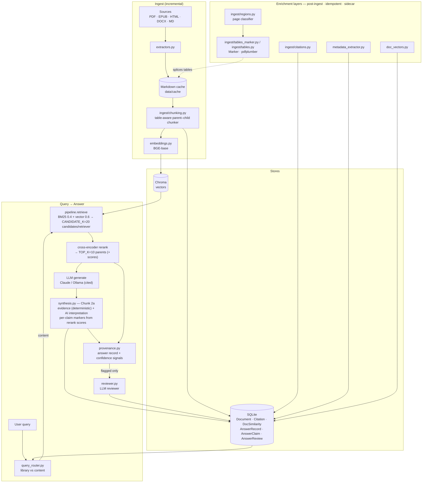
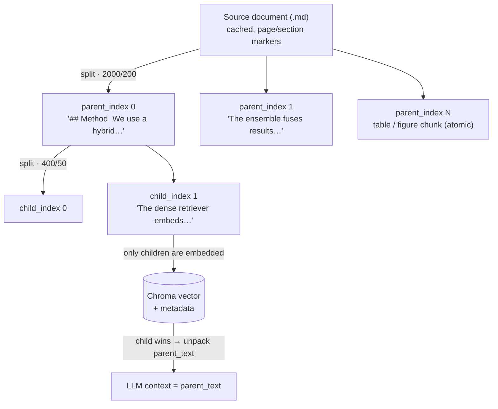

<!-- status: active · updated: 2026-07-03 · class: living -->

# Architecture

## High-level flow

```
Documents (PDF/EPUB/HTML/DOCX/MD)
↓
Extractors → Markdown cache (data/cache/)
↓
Chunker (markdown-aware, parent-child)
↓
Embeddings (BGE-base) → Chroma vector store (data/chroma/)
             ↕
         SQLite document store (Folder → Document → Part → Chunk)
↓
Hybrid retrieval (BM25 + vector, weights 0.4/0.6) → CANDIDATE_K (default 20) candidates per retriever
↓
Cross-encoder reranker → TOP_K (default 10) parents (parent context returned)
↓
LLM (Claude or local Ollama) → streamed answer with citations
```

### Full pipeline (Mermaid)

The ingest path, the post-ingest enrichment layers, and the query→answer path,
with the stores they read/write:



## Module responsibilities

| Module | Role | Public contract |
|---|---|---|
| `doc_assistant.config` | Paths, env vars, feature flags | Read-only after init; no side effects |
| `doc_assistant.extractors` | Convert any supported format → markdown | Returns `str`; raises `ExtractionError` on failure |
| `doc_assistant.ingest` (package — pipeline: `cache` · `chunking` · `store` · `cleanup` + `__init__` orchestration / `__main__` CLI; document-feature extraction: `citations` · `tables` · `tables_marker` · `figures` · `regions`) | Extract, chunk, embed, store; orphan cleanup + partial-write self-heal; table/figure/citation extraction (sidecar) | Idempotent per content hash; per-document failures isolated |
| `doc_assistant.pipeline` | RAG runtime: retrieve, rerank, generate | Returns `Answer` with citations; raises `PipelineError` |
| `doc_assistant.chat_controller` | UI-agnostic turn orchestration | Yields `TurnEvent`s → `TurnResult`; no UI-framework import (PR-M0) |
| `doc_assistant.health` | Document health scoring and classification | Pure function; no I/O; returns `HealthResult` |
| `doc_assistant.library` | Document store queries (browse, filter, tag) | Read-only queries against SQLite; UI-framework-agnostic |
| `doc_assistant.prompts` | Prompt templates | Pure string interpolation; no I/O |
| `doc_assistant.tracking` | Token usage tracking and cost estimation | Append-only; never raises |
| `apps/cli.py` | Terminal renderer | Renders `TurnResult`; no business logic |
| `apps/api/` | Desktop HTTP renderer (PR-M2) | FastAPI over `127.0.0.1`; `TurnEvent` → SSE, requests → controller calls; no business logic |
| `apps/desktop/` | Tauri desktop frontend (PR-M3) | Svelte 5 + Vite UI in a Tauri 2 shell; renders the API's `TurnResult`; no business logic |
| `scripts/` | One-off maintenance scripts | Not part of the importable package |

This table is non-exhaustive — it covers the core ingest/runtime modules. The research-integrity and enrichment layer (`query_router`, `synthesis`, `provenance`, `reviewer`, `metadata_extractor`, `doc_vectors`, `embeddings`, `bibtex`, `commands`, `llm`, plus the cross-document concept layer `concept_graph` and `epistemics`) is shown in the Mermaid diagram above. The document-feature extractors (`citations`, `tables`, `tables_marker`, `figures`, `regions`) now live inside the `doc_assistant.ingest` package (imported as `doc_assistant.ingest.<name>`). The concept-graph **redesign** adds `concept_skeleton` (a deterministic, zero-LLM enrichment sidecar over the curated `Concept`/`ConceptAlias` vocabulary + `Citation`/`DocSimilarity`; producers `scripts/seed_concepts.py` + `scripts/build_concept_skeleton.py`) — it lands alongside the superseded open-vocabulary `concept_graph` (KI-7), not replacing it yet.

**Boundary rule:** `apps/` contains no business logic. All logic lives in `src/doc_assistant/`. The UI layer calls the library layer; never the reverse.

## Two-tier caching

1. **Extraction cache** (`data/cache/*.md`): mirrors `data/sources/` structure.
   Invalidated by file modification time. Skips re-extraction on unchanged files.
2. **Embedding cache** (Chroma `doc_hash` metadata): invalidated by content hash.
   Skips re-embedding when content is unchanged.

Both tiers are independent: changing the chunking strategy invalidates embeddings but not extraction. Rebuild with `python -m doc_assistant.ingest --rebuild`.

Hashing is content-only (SHA-256 of extracted markdown, truncated to 16 hex chars). Documents survive path changes and re-extractions without creating orphan rows. Migration from the old path+content scheme: `scripts/archive/migrate_to_content_hash.py`.

## Chunking & retrieval units

The retriever's unit of work is not "the document" — it's a **chunk**. How documents
are split into chunks, and what gets embedded vs. what reaches the LLM, is the
parent–child scheme below. This is the default mode (`USE_PARENT_CHILD=true`); a
flat single-store mode (`baseline`) exists as a fallback.

**Two grain sizes, one link.** A document is split twice:

- **Parents** — 2000 chars, 200 overlap, split on `## `/`### `/paragraph
  boundaries (`PARENT_CHUNK_SIZE`/`_OVERLAP`). A parent is a coherent passage —
  the unit of *context* sent to the LLM.
- **Children** — 400 chars, 50 overlap (`CHILD_CHUNK_SIZE`/`_OVERLAP`). A child is
  a narrow span — the unit of *retrieval* that gets embedded and matched.

The link between them is **not a relational foreign key**. There is no `chunks`
table in SQLite; chunks live only as Chroma vectors, and the parent–child
relationship is carried in each child's Chroma **metadata**: `parent_text`,
`parent_index`, `child_index`. A child retrieves; the pipeline then unpacks that
child's `parent_text` and sends the *parent* to the model. Small unit for
precision, large unit for context.



**What a stored record looks like** (Chroma, not SQL — metadata *is* the schema):

```json
{
  "page_content": "The dense retriever embeds queries and documents…",
  "metadata": {
    "document_id": "550e8400-e29b-41d4-a716-446655440000",
    "doc_hash": "abc123", "filename": "dpr.pdf", "format": "pdf", "health": "healthy",
    "parent_text": "## Method  We use a hybrid retriever…",   // full parent → LLM context
    "parent_index": 0, "child_index": 1,
    "page": 3, "section": "Method",
    "chunk_type": null, "figure_id": null                     // "figure" for VLM-described figures
  }
}
```

**Tables & figures are atomic chunks.** A table is spliced into the cached markdown
and merged with its caption into a single parent==child block (the caption is the
retrieval "magnet"). A figure becomes a `chunk_type="figure"` chunk only *after* the
VLM description pass — `(caption + vlm_description)`; the PNG image itself is never
embedded. See `figures-and-tables.md`.

**Document structure is scaffolded but unused.** The `DocumentPart` table
(`db/models.py`) can hold a chapter/section tree (`kind`, `title`,
`parent_part_id`), but it is not currently populated and chunks do not link to it.
This is the seam the book-oriented redesign builds on (ADR-009): the current scheme
is tuned for short, section-headed papers and degrades on long, chaptered books.

All chunk sizes and retrieval weights are **locked settings** — changed only via an
eval-harness experiment, never edited ad hoc. See `.claude/CONTEXT.md`.

## Document health model

Each ingested document is scored on five signals: chunk count, chunks-per-page ratio, average chunk length, section detection rate, reference-flagged chunk ratio.

- Score ≥ 75 → **healthy**
- Score ≥ 40 → **marginal** (retrievable, flagged)
- Score < 40 → **broken** (retrievable, prominently flagged)

Classification is informational, never blocking. Broken documents remain queryable.

## Engineering standards

### Security
- No secrets in code. `.env` is gitignored. `.env.example` committed with placeholders.
- `bandit` SAST runs in CI and pre-commit. HIGH findings block merge.
- `pip-audit` runs in CI on every push.
- `detect-secrets` baseline committed; hook runs in pre-commit.

### CI/CD
- GitHub Actions on every push and PR: ruff lint + format-check → mypy → pytest with coverage (fail-under 40) → bandit → pip-audit (advisory, non-blocking) → detect-secrets.
- Merging on red pipeline is never allowed.
- Coverage floor: 40% (CI-enforced; `--cov-fail-under=40` in ci.yml). Raise toward 45%+ as integration tests land. Target: 85% for core pipeline and ingest logic.

### Pre-commit (mandatory)
Hooks: ruff (lint + format), mypy, bandit, detect-secrets, standard file hygiene.

### Logging
Structured JSON logging in staging/production via `structlog`. Development uses pretty console output. No `print()` in `src/`. Log entries include: level, timestamp, module, event, and operation-specific context fields. Secrets and PII are never logged.

### Development log
Maintain `docs/DEVLOG.md` — append one entry per logical change (what / why / rejected / opens). See dev-log skill for format. Append only, never edit past entries.

### Error handling
Exception hierarchy rooted at `DocAssistantError`. Domain errors (ExtractionError, IngestError, PipelineError) are typed and documented. Infrastructure errors (StorageError, ExternalServiceError) propagate with context via `raise X from e`. User-facing errors are translated at the UI boundary; internal traces go to logs only.

### Testing
```
tests/
├── fixtures/             # shared fixtures (synthetic_corpus.py)
├── unit/                 # fast, no I/O, no LLM
│   └── test_<module>.py
├── integration/          # cross-module, may use temp files, mocked LLM
│   └── test_<flow>.py
└── eval/                 # RAG evaluation harness (not part of standard CI run)
    ├── run_eval.py       # legacy recall@K harness (eval_set.json); canonical harness is scripts/run_eval.py
    ├── cases.yaml / cases.public.yaml   # consumed by scripts/run_eval.py
    ├── TESTING.md        # what each tier and scorer measures
    └── baselines/        # recorded eval baselines
```

Unit tests run on every commit (pre-commit). Full suite (unit + integration) runs in CI — free, no API calls. Eval harness runs manually at phase checkpoints and costs money (Anthropic API for the LLM judge).

The testing strategy — what each tier and each eval scorer measures, why, and the reproducible public-corpus benchmark — is documented in [`tests/eval/TESTING.md`](../tests/eval/TESTING.md).

Run commands:
- `uv run pytest tests/unit/ tests/integration/` — free, fast, CI default
- `uv run python -m scripts.run_eval` — manual, costs API tokens (the canonical harness; reads `tests/eval/cases.yaml`, persists to `data/eval.duckdb`)
- `uv run pytest -m api` — any future tests marked with `@pytest.mark.api`
