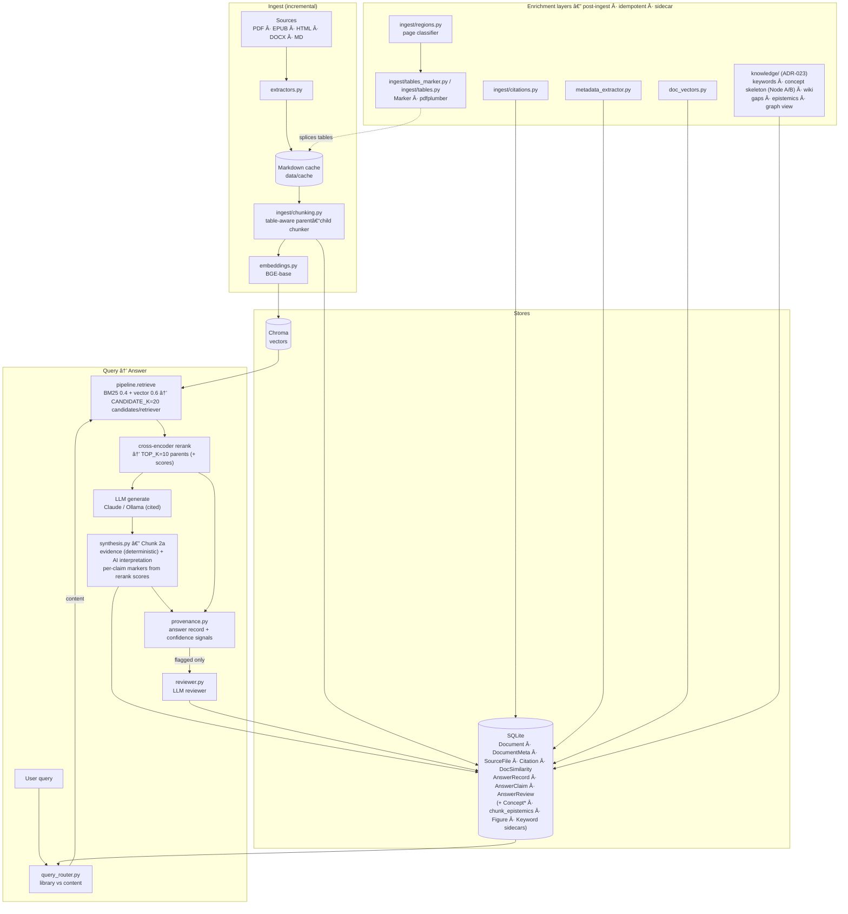
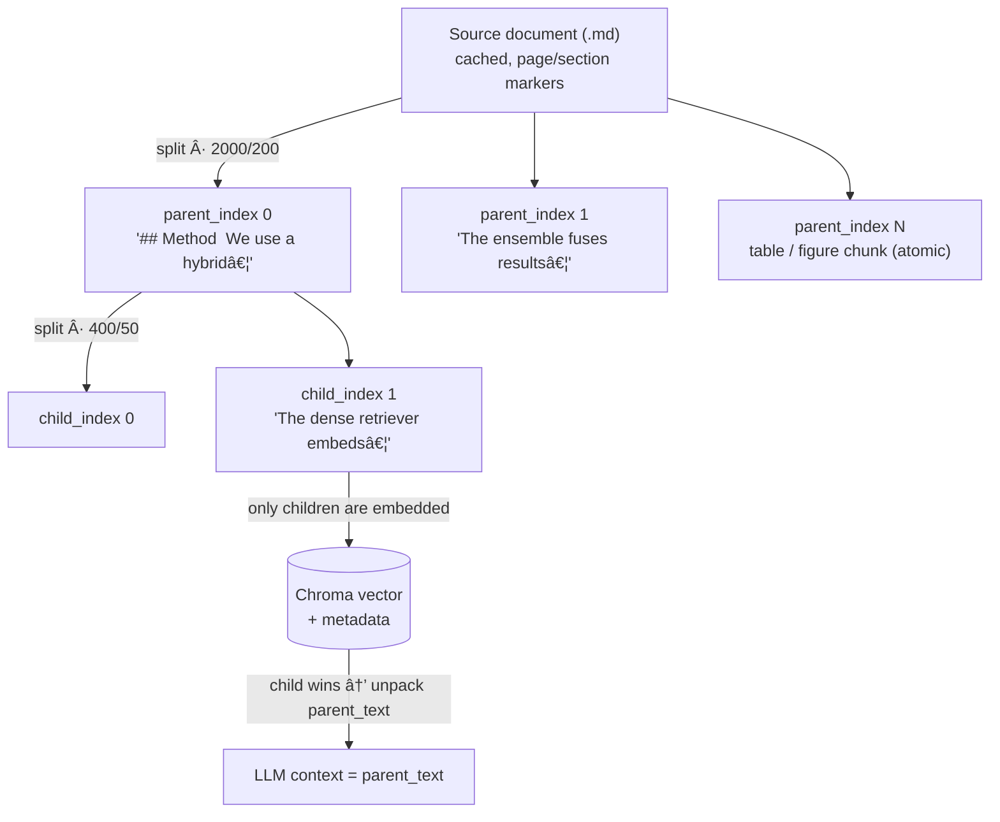

<!-- status: active · updated: 2026-08-05 (setup domain row — ADR-034) · class: living -->

# Architecture

## High-level flow

```
Documents (PDF/EPUB/HTML/DOCX/MD)
↓
Extractors → Markdown cache (data/cache/)
↓
Chunker (markdown-aware, parent-child)
↓
Embeddings (BGE-base) → Chroma vector store (data/chroma/)
             ↕
         SQLite document store (Folder → Document → Part → Chunk)
↓
Hybrid retrieval (BM25 + vector, weights 0.4/0.6) → CANDIDATE_K (default 20) candidates per retriever
↓
Cross-encoder reranker → TOP_K (default 10) parents (parent context returned)
↓
LLM (Claude or local Ollama) → streamed answer with citations
```

### Full pipeline (Mermaid)

The ingest path, the post-ingest enrichment layers, and the query→answer path,
with the stores they read/write:


```mermaid
flowchart TD
    subgraph ING["Ingest (incremental)"]
        SRC["Sources<br/>PDF · EPUB · HTML · DOCX · MD"] --> EXT["extractors.py"]
        EXT --> CACHE[("Markdown cache<br/>data/cache")]
        CACHE --> CHUNK["ingest/chunking.py<br/>table-aware parent–child chunker"]
        CHUNK --> EMB["embeddings.py<br/>BGE-base"]
    end

    subgraph ENR["Enrichment layers — post-ingest · idempotent · sidecar"]
        REG["ingest/regions.py<br/>page classifier"] --> TBL["ingest/tables_marker.py / ingest/tables.py<br/>Marker · pdfplumber"]
        CIT["ingest/citations.py"]
        MD["metadata_extractor.py"]
        DV["doc_vectors.py"]
        KNW["knowledge/ (ADR-023)<br/>keywords · concept skeleton (Node A/B) · wiki<br/>gaps · epistemics · graph view"]
    end

    subgraph ST["Stores"]
        CHROMA[("Chroma<br/>vectors")]
        SQL[("SQLite<br/>Document · DocumentMeta · SourceFile · Citation · DocSimilarity<br/>AnswerRecord · AnswerClaim · AnswerReview<br/>(+ Concept* · chunk_epistemics · Figure · Keyword sidecars)")]
    end

    subgraph QRY["Query → Answer"]
        Q["User query"] --> ROUTE["query_router.py<br/>library vs content"]
        ROUTE -->|content| RET["pipeline.retrieve<br/>BM25 0.4 + vector 0.6 → CANDIDATE_K=20 candidates/retriever"]
        RET --> RR["cross-encoder rerank<br/>→ TOP_K=10 parents (+ scores)"]
        RR --> GEN["LLM generate<br/>Claude / Ollama (cited)"]
        GEN --> SYN["synthesis.py — Chunk 2a<br/>evidence (deterministic) + AI interpretation<br/>per-claim markers from rerank scores"]
        SYN --> PROV["provenance.py<br/>answer record + confidence signals"]
        PROV -->|flagged only| REV["reviewer.py<br/>LLM reviewer"]
    end

    EMB --> CHROMA
    CHUNK --> SQL
    CIT --> SQL
    MD --> SQL
    DV --> SQL
    KNW --> SQL
    TBL -. splices tables .-> CACHE
    CHROMA --> RET
    SQL --> ROUTE
    RR --> PROV
    SYN --> SQL
    REV --> SQL
```

## Module responsibilities

| Module | Role | Public contract |
|---|---|---|
| `doc_assistant.config` | Paths, env vars, feature flags | Read-only after init; no side effects |
| `doc_assistant.extractors` | Convert any supported format → markdown | Returns `str`; raises `ExtractionError` on failure |
| `doc_assistant.ingest` (package — pipeline: `cache` · `chunking` · `store` · `cleanup` · `registry` (S1 `SourceFile` source registry + selection-scoped ingest) + `__init__` orchestration / `__main__` CLI; document-feature extraction: `citations` · `tables` · `tables_marker` · `figures` · `regions`) | Extract, chunk, embed, store; orphan cleanup + partial-write self-heal; source scan/select (`--files`/`--dry-run`, exclude flags); table/figure/citation extraction (sidecar) | Idempotent per content hash; per-document failures isolated; selection never bypasses the locked six-stage ingest |
| `doc_assistant.pipeline` | RAG runtime: retrieve, rerank, generate | Returns `Answer` with citations; raises `PipelineError` |
| `doc_assistant.chat_controller` (package — `session` · `views` · `events` · `helpers` · `controller`; direction is strictly session/views → events/helpers → controller) | UI-agnostic turn orchestration | Yields `TurnEvent`s → `TurnResult`; no UI-framework import (PR-M0) |
| `doc_assistant.health` | Document health scoring and classification | Pure function; no I/O; returns `HealthResult` |
| `doc_assistant.library` (package — `models` · `documents` · `pins` · `folders` · `keywords` · `chunks` · `citations` · `similarity`; sub-domain names match `apps/api/routers/library/`) | Document store queries (browse, filter, tag) + the Library's write paths: `DocumentMeta` overrides (ADR-013) and `delete_document` (ADR-014 — trash-first source-file recycle, then row/meta/chunks/figures/cache) | Queries + two explicit, ADR-recorded write paths; UI-framework-agnostic |
| `doc_assistant.knowledge` (package — `keywords` · `keyword_families` · `concept_skeleton` (Node A) · `concept_skeleton_enrich` (Node B) · `concept_curation` · `concept_semantics` · `concept_graph_view` · `wiki` · `gaps` · `gap_suggest` · `epistemics`) | The Phase-7 knowledge layer: mined vocabulary, curated concept skeleton, wiki notes, gap detection, chunk epistemics — all derived *from* the corpus (ADR-023) | Enrichment-Layer Pattern throughout: additive sidecars, idempotent `scripts/` runners, never writes the chunk store; the answer path reads it but never depends on it |
| `doc_assistant.prompts` | Prompt templates | Pure string interpolation; no I/O |
| `doc_assistant.tracking` | Token usage tracking and cost estimation | Append-only; never raises |
| `apps/cli.py` | Terminal renderer | Renders `TurnResult`; no business logic |
| `apps/api/` | Desktop HTTP renderer (PR-M2) | FastAPI over `127.0.0.1`; `TurnEvent` → SSE, requests → controller calls; no business logic |
| `apps/desktop/` | Tauri desktop frontend (PR-M3) | Svelte 5 + Vite UI in a Tauri 2 shell; renders the API's `TurnResult`; no business logic |
| `scripts/` | One-off maintenance scripts | Not part of the importable package |

This table is non-exhaustive — it covers the core ingest/runtime modules. The research-integrity layer (`query_router`, `synthesis`, `provenance`, `reviewer`, `metadata_extractor`, `metadata_enrich` (deterministic backfill runner, L5), `doc_vectors`, `embeddings`, `bibtex`, `commands`, `llm`) is shown in the Mermaid diagram above. The document-feature extractors (`citations`, `tables`, `tables_marker`, `figures`, `regions`) live inside the `doc_assistant.ingest` package. The cross-document knowledge layer lives inside `doc_assistant.knowledge` (ADR-023, imported as `doc_assistant.knowledge.<name>`): `concept_skeleton` is a deterministic, zero-LLM enrichment sidecar over the curated `Concept`/`ConceptAlias` vocabulary + `Citation`/`DocSimilarity` (producers `scripts/seed_concepts.py` + `scripts/build_concept_skeleton.py`), `concept_skeleton_enrich` is the confined Node-B LLM pass, and `epistemics`/`wiki`/`gaps` read the skeleton directly. The superseded open-vocabulary `concept_graph.py` was **deleted 2026-07-07** (G1, KI-7 resolved).

**Boundary rule:** `apps/` contains no business logic. All logic lives in `src/doc_assistant/`. The UI layer calls the library layer; never the reverse.

## Repository layout

```
src/doc_assistant/    # core library — the RAG answer path lives at the top level
  db/                 #   SQLAlchemy models + additive migrations
  ingest/             #   extract → markdown → chunk → embed → store (+ tables/figures/citations)
  knowledge/          #   corpus-derived layer: keywords, concept skeleton, wiki, gaps, epistemics
  eval/               #   the eval harness (runner, scorers, result store)
apps/                 # UIs — thin shells, no business logic (FastAPI/SSE · Tauri/Svelte · CLI)
scripts/              # idempotent enrichment/eval runners + build tooling
tests/                # unit, integration, eval harness cases + committed baselines
evals/                # benchmark results — the write-ups + how to reproduce each number
docs/                 # architecture, ADRs (docs/decisions/), specs, roadmap, the demo GIF
data/                 # runtime data (sources, caches, vector stores, SQLite) — not committed
```

### `apps/` — the domain spine

Both shells are organised on **one axis: the domain**, and the domain words are the same on
both sides of the wire. To review a feature end to end, read one row.

| Domain | Wire model | Route | Desktop UI |
|---|---|---|---|
| chat | `models/chat.py` | `routers/chat.py` | `lib/chat/` (Turn, SourcePanel, ClaimReview…) |
| compare | `models/compare.py` | `routers/chat.py` (`/api/compare`) | `lib/chat/CompareCard.svelte` |
| conversations | `models/conversations.py` | `routers/conversations.py` | `lib/shell/Sidebar.svelte` |
| library | `models/library.py` | `routers/library/documents.py` | `lib/library/` (Grid, Browser, MetaEditor…) |
| connections | `models/connections.py` | `routers/library/documents.py` | `lib/library/DocConnections.svelte` |
| folders | `models/folders.py` | `routers/library/folders.py` | `lib/library/LibraryManageFolders.svelte` |
| keywords | `models/keywords.py` | `routers/library/keywords.py` | `lib/library/LibraryManageKeywords.svelte` |
| concepts / graph | `models/concepts.py` | `routers/concepts.py` | `lib/graph/` (ConceptGraph, GraphIndex, GapList) |
| taxonomy | `models/taxonomy.py` | `routers/taxonomy.py` | `lib/library/LibraryTaxonomy.svelte` |
| settings | `models/settings.py` | `routers/settings.py` | `lib/settings/Settings.svelte` |
| setup (first run) | `models/setup.py` | `routers/setup.py` | `lib/settings/ProviderSetup.svelte` |
| sources (ingestion) | `models/sources.py` | `routers/sources.py` | `lib/settings/Sources.svelte` |
| health | — | `routers/health.py` | `lib/shell/` (status bar) |

Two frontend folders have no API counterpart, by design:

- `lib/shell/` — chrome that belongs to no domain: sidebar, global search, dialogs, `Icon.svelte`
  (the one component imported across every folder).
- `lib/core/` — the wire boundary itself, split by the same domain names: `api/<domain>.ts`
  (thin fetch clients, shared base + error unwrapper in `_base.ts`) and `types/<domain>.ts`
  (mirrors `apps/api/models/<domain>.py`), plus `theme.ts` and `fonts.css`. Both carry an
  `index.ts` barrel, so `from '../core/api'` still resolves; prefer the domain module.

Two naming traps this table exists to prevent:

- **`sources` is ingestion, not citations.** `models/sources.py` and `lib/settings/Sources.svelte`
  are files on disk; the *citation* sources of an answer are `SourceViewPayload` in `models/chat.py`
  and `lib/chat/Source*.svelte`.
- **`library` is three sub-domains.** Documents, folders and keyword families all live under
  `/api/library/*` and are split one module per sub-domain on both sides.

## Two-tier caching

1. **Extraction cache** (`data/cache/*.md`): mirrors `data/sources/` structure.
   Invalidated by file modification time. Skips re-extraction on unchanged files.
2. **Embedding cache** (Chroma `doc_hash` metadata): invalidated by content hash.
   Skips re-embedding when content is unchanged.

Both tiers are independent: changing the chunking strategy invalidates embeddings but not extraction. Rebuild with `python -m doc_assistant.ingest --rebuild`.

Hashing is content-only (SHA-256 of extracted markdown, truncated to 16 hex chars). Documents survive path changes and re-extractions without creating orphan rows. Migration from the old path+content scheme: `scripts/archive/migrate_to_content_hash.py`.

## Chunking & retrieval units

The retriever's unit of work is not "the document" — it's a **chunk**. How documents
are split into chunks, and what gets embedded vs. what reaches the LLM, is the
parent–child scheme below. This is the default mode (`USE_PARENT_CHILD=true`); a
flat single-store mode (`baseline`) exists as a fallback.

**Two grain sizes, one link.** A document is split twice:

- **Parents** — 2000 chars, 200 overlap, split on `## `/`### `/paragraph
  boundaries (`PARENT_CHUNK_SIZE`/`_OVERLAP`). A parent is a coherent passage —
  the unit of *context* sent to the LLM.
- **Children** — 400 chars, 50 overlap (`CHILD_CHUNK_SIZE`/`_OVERLAP`). A child is
  a narrow span — the unit of *retrieval* that gets embedded and matched.

The link between them is **not a relational foreign key**. There is no `chunks`
table in SQLite; chunks live only as Chroma vectors, and the parent–child
relationship is carried in each child's Chroma **metadata**: `parent_text`,
`parent_index`, `child_index`. A child retrieves; the pipeline then unpacks that
child's `parent_text` and sends the *parent* to the model. Small unit for
precision, large unit for context.


```mermaid
flowchart TB
    D["Source document (.md)<br/>cached, page/section markers"]
    D -->|"split · 2000/200"| P0["parent_index 0<br/>'## Method  We use a hybrid…'"]
    D --> P1["parent_index 1<br/>'The ensemble fuses results…'"]
    D --> PN["parent_index N<br/>table / figure chunk (atomic)"]
    P0 -->|"split · 400/50"| C0["child_index 0"]
    P0 --> C1["child_index 1<br/>'The dense retriever embeds…'"]
    C1 -->|"only children are embedded"| CH[("Chroma vector<br/>+ metadata")]
    CH -->|"child wins → unpack parent_text"| LLM["LLM context = parent_text"]
```

**What a stored record looks like** (Chroma, not SQL — metadata *is* the schema):

```json
{
  "page_content": "The dense retriever embeds queries and documents…",
  "metadata": {
    "document_id": "550e8400-e29b-41d4-a716-446655440000",
    "doc_hash": "abc123", "filename": "dpr.pdf", "format": "pdf", "health": "healthy",
    "parent_text": "## Method  We use a hybrid retriever…",   // full parent → LLM context
    "parent_index": 0, "child_index": 1,
    "page": 3, "section": "Method",
    "chunk_type": null, "figure_id": null                     // "figure" for VLM-described figures
  }
}
```

**Tables & figures are atomic chunks.** A table is spliced into the cached markdown
and merged with its caption into a single parent==child block (the caption is the
retrieval "magnet"). A figure becomes a `chunk_type="figure"` chunk only *after* the
VLM description pass — `(caption + vlm_description)`; the PNG image itself is never
embedded. See `figures-and-tables.md`.

**Document structure is scaffolded but unused.** The `DocumentPart` table
(`db/models.py`) can hold a chapter/section tree (`kind`, `title`,
`parent_part_id`), but it is not currently populated and chunks do not link to it.
This is the seam the book-oriented redesign builds on (ADR-009): the current scheme
is tuned for short, section-headed papers and degrades on long, chaptered books.

All chunk sizes and retrieval weights are **locked settings** — changed only via an
eval-harness experiment, never edited ad hoc. See `.claude/CONTEXT.md`.

## Concept & knowledge system

The Phase-7 knowledge layer has grown over many increments (ADR-006/008/015/017/018/019/023/028).
This is the canonical map of how its pieces relate; the module list is in *Module responsibilities*
above, and each design choice is in the ADR named beside it.

**One table, four hats.** Everything hangs off a single `Concept` table (`db/models.py::Concept`) —
one id-space by deliberate choice (PR-G1 fixed the KI-15 id/label confusion by making it so). The same
row is read four ways:

1. **Keyword candidate → Concept.** `Keyword` rows are per-document mined terms (`knowledge/keywords.py`,
   ADR-006 contrastive termhood) — *candidates only*, never auto-promoted. The user promotes one into a
   curated `Concept` (`promote_keyword`). The 2026-07-05 `--promote-all` flood (ADR-018) is why that
   boundary is load-bearing.
2. **keyword family** — a `Concept` whose `ConceptAlias` rows hold member keyword names, used to collapse
   near-duplicates (`llm`/`llms`) in the Library filter (ADR-015). Families **ignore `graph_include`** by
   design; the graph respects it. Same rows, two consumers — the boundary ADR-015 named and ADR-018 paid for.
3. **concept-skeleton node** — a `Concept` with `graph_include=true` becomes a node in the derived graph.
4. **taxonomy node** *(decided, unbuilt)* — under ADR-028 a `Concept` also carries a `kind`
   (`concept` | `domain`), letting abstract field nodes share the id-space.

> **Orientation:** [`knowledge-layer.md`](knowledge-layer.md) is the one-page map of what this whole
> layer is *for* (corroboration · coverage · navigation), how the pieces connect, and — since
> 2026-08-03 — a **trust table** marking which of its signals are sound. `contested` /
> `superseded_trend` are **not** corpus measurements (KI-33, ADR-040/ADR-041); read that table before
> citing any marker. This section stays the mechanism reference.

**Two graph layers over the same nodes.** These are distinct and must not be conflated:

| Layer | What | Store | Lifecycle | ADR |
|---|---|---|---|---|
| **Derived** (association) | co-occurrence edges + Louvain communities (Node A), optionally LLM relation/stance (Node B) | `concept_edges` + `data/skeleton/skeleton.json` | **dropped & rebuilt** every `build_concept_skeleton` run (~7 s, deterministic) | ADR-008 |
| **Curated** (classification) | the user's `is_a`/`in_field` hierarchy — a polyhierarchical SKOS DAG | `concept_hierarchy` table *(spec'd, unbuilt)* | **survives a rebuild** — lives beside `Concept`, never in `concept_edges` | ADR-019→ADR-028 |

The load-bearing rule: **curated structure must never live in `concept_edges`**, because a routine rebuild
would wipe it (the KI-17/KI-20 class of bug). Node A is zero-LLM; **Node B is a confined LLM pass that
only annotates existing edges** — it never creates a node or edge, and `build_concept_skeleton --apply`
*without* `--enrich` silently wipes its annotations (rebuild with `--apply --enrich` together).

**What reads the graph.** `epistemics.py` projects skeleton node weights onto chunks (`chunk_epistemics`)
→ the answer-path markers + E2 source strip; `gaps.py` runs deterministic detectors over the skeleton
(`isolated`/`single_source`/`thin_bridge`/`under_connected`/`unsourced_claim`) → the gap list, with a
`gap_triage` override table that survives rebuilds; `wiki.py` clusters over communities. All are
**read-only over the vocabulary** — the graph UI never edits concepts, it deep-links to Manage-keywords
(ADR-017 A1). The single write surface for the curated hierarchy will be a dedicated taxonomy view (ADR-028).

**Current build state (2026-07-23).** Node A skeleton, keyword families, gap layer, epistemics projection,
and the read-only graph/gap UI are **built and shipped**. The taxonomy layer (`kind`, `concept_hierarchy`,
`document_field`, `knowledge/taxonomy.py`, `seed_taxonomy`) is **decided (ADR-028) and design-locked
(`docs/specs/feature-taxonomy-seed-schema.md`) but not yet built**. Node-B stance regeneration is a local-LLM
cost decision (KI-4, RTX box). The superseded open-vocabulary `concept_graph.py` was deleted 2026-07-07
(KI-7); `data/graph/graph.json` is a stale empty decoy from that era — the live artifact is
`data/skeleton/skeleton.json`.

## Document health model

Each ingested document is scored on five signals: chunk count, chunks-per-page ratio, average chunk length, section detection rate, reference-flagged chunk ratio.

- Score ≥ 75 → **healthy**
- Score ≥ 40 → **marginal** (retrievable, flagged)
- Score < 40 → **broken** (retrievable, prominently flagged)

Classification is informational, never blocking. Broken documents remain queryable.

## Engineering standards

### Security
- No secrets in code. `.env` is gitignored. `.env.example` committed with placeholders.
- `bandit` SAST runs in CI and pre-commit. HIGH findings block merge.
- `pip-audit` runs in CI on every push.
- `detect-secrets` baseline committed; hook runs in pre-commit.

### CI/CD
- GitHub Actions on every push and PR: ruff lint + format-check → mypy → pytest with coverage (fail-under 40) → bandit → pip-audit (advisory, non-blocking) → detect-secrets.
- Merging on red pipeline is never allowed.
- Coverage floor: 40% (CI-enforced; `--cov-fail-under=40` in ci.yml). Raise toward 45%+ as integration tests land. Target: 85% for core pipeline and ingest logic.

### Pre-commit (mandatory)
Hooks: ruff (lint + format), mypy, bandit, detect-secrets, standard file hygiene.

### Logging
Structured JSON logging in staging/production via `structlog`. Development uses pretty console output. No `print()` in `src/`. Log entries include: level, timestamp, module, event, and operation-specific context fields. Secrets and PII are never logged.

### Development log
Maintain `docs/DEVLOG.md` — append one entry per logical change (what / why / rejected / opens). See dev-log skill for format. Append only, never edit past entries.

### Error handling
Exception hierarchy rooted at `DocAssistantError`. Domain errors (ExtractionError, IngestError, PipelineError) are typed and documented. Infrastructure errors (StorageError, ExternalServiceError) propagate with context via `raise X from e`. User-facing errors are translated at the UI boundary; internal traces go to logs only.

### Testing
```
tests/
├── fixtures/             # shared fixtures (synthetic_corpus.py)
├── unit/                 # fast, no I/O, no LLM
│   └── test_<module>.py
├── integration/          # cross-module, may use temp files, mocked LLM
│   └── test_<flow>.py
└── eval/                 # RAG evaluation harness (not part of standard CI run)
    ├── run_eval.py       # legacy recall@K harness (eval_set.json); canonical harness is scripts/run_eval.py
    ├── cases.yaml / cases.public.yaml   # consumed by scripts/run_eval.py
    ├── TESTING.md        # what each tier and scorer measures
    └── baselines/        # recorded eval baselines
```

Unit tests run on every commit (pre-commit). Full suite (unit + integration) runs in CI — free, no API calls. Eval harness runs manually at phase checkpoints and costs money (Anthropic API for the LLM judge).

The testing strategy — what each tier and each eval scorer measures, why, and the reproducible public-corpus benchmark — is documented in [`tests/eval/TESTING.md`](../tests/eval/TESTING.md). The benchmark *results* write-ups (headline numbers, sweeps, reproduction) live in the top-level [`evals/`](../evals/README.md) folder (ADR-024); the underlying run data stays in `tests/eval/baselines/`.

Run commands:
- `uv run pytest tests/unit/ tests/integration/` — free, fast, CI default
- `uv run python -m scripts.run_eval` — manual, costs API tokens (the canonical harness; reads `tests/eval/cases.yaml`, persists to `data/eval.duckdb`)
- `uv run pytest -m api` — any future tests marked with `@pytest.mark.api`
