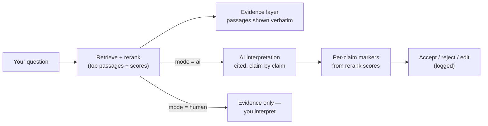

# How answers work — evidence vs. interpretation

This assistant is built for research, so it tries to be clear about **what comes
from your documents and what comes from the AI**. Every answer is built in two
visible layers.

## The two layers

**1. Evidence — what your sources actually say.**
These are the passages the retriever found and the reranker ranked highest, shown
*verbatim* with their source, page, and a relevance score (e.g. `dpr.pdf, p.4 ·
relevance 0.82`). No model rewrites this layer — it is the ground truth you can
check.

**2. Interpretation — the AI's synthesis.**
This is the model's answer, written from the evidence above and **clearly labelled
as AI interpretation**. It cites its sources inline (`[1]`, `[2]`, …), each number
pointing at a passage in the evidence layer.

The point of the split: you can always see where the documents stop and the model's
reasoning starts, so an AI inference never gets mistaken for a citable fact.

## Per-claim markers (and why they're trustworthy)

The interpretation is broken into claims (roughly one per sentence). Each claim
carries a marker derived from **retrieval signals, not the model's own
confidence** (language models are systematically over-confident, so we don't ask
them how sure they are):

- **(unmarked)** — the claim cites a source the reranker scored as relevant.
- **⚠ weakly grounded** — the claim cites a source with a low relevance score.
- **⚠ unsupported** — the claim cites *no* source.

The interface stays quiet when everything is clean: review buttons appear **only**
on the flagged claims. Markers are a heuristic signal to look closer, not a
correctness guarantee.

## You stay in control

On a flagged claim you can **accept**, **reject**, or **edit** it. Your decision is
logged alongside the answer's provenance record — so AI-assisted output stays
auditable (and, later, exportable as a methodology disclosure).

## Two modes

Set `SYNTHESIS_MODE` in `.env` (or check the current one with `/synthesis`):

- **`ai`** (default) — both layers: evidence + the labelled AI interpretation with
  per-claim markers and the accept/reject/edit loop.
- **`human`** — **evidence only**. The AI returns the passages and does *not* write
  an interpretation — the synthesis is yours. (It's also faster: no generation call.)

## The flow

## What the markers can and can't tell you

A marker comes from one signal: the reranker's **relevance score** for the source a
claim cites. That score answers *"how relevant was this passage to your question?"* —
not *"is this sentence true?"* and not *"does this passage actually support this exact
claim?"* Two consequences follow:

- **A clean (unmarked) claim is not "verified."** A high score means the cited passage
  was relevant to the query — the model can still misstate what a genuinely-relevant
  source says, or cite a passage that's on-topic but doesn't back that specific
  sentence. No marker means *"retrieval looked fine here,"* not *"this is correct."*
- **A ⚠ flag is not proof of a problem.** The most common false alarm is a sentence
  that got separated from its citation. We've seen exactly this: *"…DPR outperforms
  BM25 [2]. 42.9% in Top-5 accuracy on Natural Questions."* — the `[2]` sits on the
  first sentence, so the statistic, read alone, looks uncited and is flagged
  `unsupported`, even though the same source backs it.

So read the markers as **"look here,"** not as a fact-check. They're deliberately a
cheap, *observable* signal — derived from retrieval, never from the model rating its
own confidence (language models are systematically over-confident, which is the whole
reason we don't use self-reported scores).

## Why the claim-splitting is rough — and why `edit` exists

Claims are split on sentence boundaries: simple and deterministic, but imperfect. One
sentence can carry two assertions; one assertion can span two sentences (the claim,
then its statistic — the case above); a heading or a transition can be treated as a
"claim." That roughness is a deliberate trade-off — using a model to extract "clean"
claims would re-introduce the very model-judgment this layer exists to keep out (and
cost an extra call). The price is imperfect boundaries; the remedy is **edit** — you
can rewrite any claim's text, and your edit is what gets logged. The machine does the
cheap, reproducible part; you make the call.

## The deeper check

A reference-free **LLM reviewer** can grade the answer's faithfulness against the
retrieved text — a real model judgment, not a retrieval heuristic. To keep cost down
it runs **only** on answers the confidence signals already flag (or on demand via
`/review`), so it complements the markers rather than replacing them.
