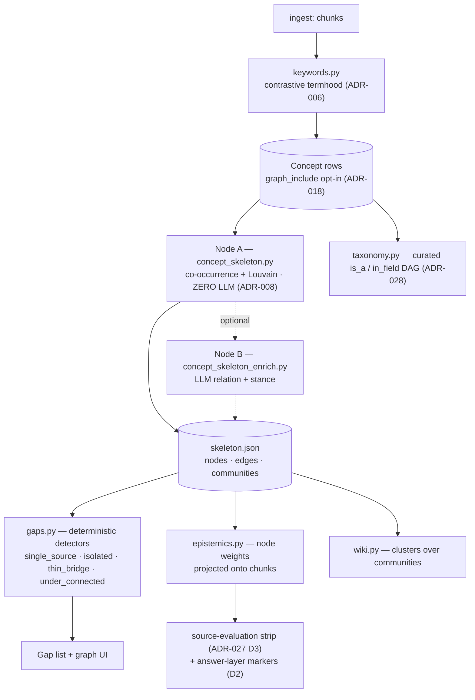

<!-- status: active · updated: 2026-08-11 (text repaired from double-encoded — the trust table's ⚠️/❌ column was unreadable; content unchanged since 2026-08-05) · class: living -->

# The knowledge layer — what the concept graph is for, and which of its signals you can trust

The one-page orientation for the concept graph, the gap layer, epistemics markers and the wiki:
**why they exist, how they connect, and what each output is actually worth.** Sibling of
[`how-answers-work.md`](how-answers-work.md), which does the same for the answer path.

This file is a **map, not a source of truth**. Mechanism detail lives in
[`architecture.md`](architecture.md) § *Concept & knowledge system*; the design record lives in
`docs/specs/feature-concept-graph.md` and the ADRs cited per section. Where they disagree with this
page, they win — but tell this page.

> **Why this page exists.** The purpose was written down (in a feature spec), the mechanism was
> written down (in architecture.md), and the decisions were written down (across nine ADRs) — but
> nothing connected them, so nothing noticed when an output stopped matching the purpose. That is
> not hypothetical: see *Trust status* below.

---

## 1. The job

From `feature-concept-graph.md` § *The job* (locked with the user 2026-07-17) — **three questions,
one surface**:

1. **Corroboration** — *"is this concept backed by more than one source?"* In the user's words:
   *"Technically, having a single source is not good."* A method known only from the paper that
   invented it has had no independent evaluation, replication or critique.
2. **Coverage** — *"have I read the field?"* A PhD student must cover a literature; a professor
   covers a field plus contingent ones.
3. **Navigation** — *"explore the sources through the graph"*, down to the chunks.

**This is not an Obsidian-style corpus browser.** ADR-004's north star: *surface what the user (and
the LLM) cannot see — concepts the corpus under-supports, claims it cannot source, and directions
the user did not think to look.* **The graph is the substrate; the gaps are the payload.**

### The intent behind those three questions (user, 2026-08-03)

The three questions above are the surface description. The product intent, stated directly, is what
they are *for*:

> *"The goal is to see which claims are unsubstantiated and where are the knowledge gaps inside the
> documentation. … The most barebone goal of the graph feature is to be able to classify knowledge
> per concept in order to find the gaps where the user, for a given subject, should find more
> resources and documents. It is supposed to both expose the gaps and make research of information
> easier. … We want epistemics feature. That is the idea."*

Three consequences worth holding on to:

1. **The output is an acquisition instruction.** Not "here is your corpus" but *"for this subject,
   go find more on X."* A gap that does not point somewhere has not done its job.
2. **The unit is the concept.** Knowledge classified *per concept*. Note that today's epistemics
   classifies **edges** (concept pairs) and reaches concepts only by aggregating them — a unit
   mismatch with the goal, recorded in ADR-041.
3. **A gap is a deviation from expected structure, not an absolute count.** The user's framing:
   *concepts are linked in general to predictable things.* That is what makes "missing" detectable —
   and it means the expected structure needs a source (the curated taxonomy, ADR-028; or the
   external Tier-2b reach ADR-004 deferred). It is the same reference-class argument ADR-040 reached
   from the other direction.

**And a distinction that is easy to lose:** all three of B1's questions are answerable by **counting
documents** — corroboration is `len(doc_ids) >= 2`, coverage is presence per field, navigation is
`node → doc_ids → chunk_keys` — so the *skeleton* needs no LLM, and RG-014 graded `single_source`, a
document count, as the one detector that is a *"TRUE POSITIVE — the product thesis"*. **That is an
argument about how to build the substrate cheaply, not an argument that epistemics is optional.**
Epistemics is wanted; it is the part that has to be built on evidence rather than on labels.

---

## 2. The vocabulary — one table, two opt-ins

There is **one** `Concept` table (ADR-015): keyword families and graph nodes are the same rows, so
there is never a second vocabulary to reconcile.

| | what it means | who sets it |
|---|---|---|
| `kind = concept` / `domain` | a concept, or an ANZSRC field node (ADR-028) | seeding / curation |
| `graph_include` | **opt-in** — this concept participates in the graph (ADR-018) | CLI only; the graph UI is read-only (ADR-017) |

`graph_include` is load-bearing history: one `seed_concepts --promote-all` in 2026-07 flooded the
graph to 357 concepts. The flag is what keeps the graph curated while
`library.list_keyword_families()` deliberately still shows everything.

---

## 3. Two graph layers over the same nodes — never conflate them

| layer | what | store | lifecycle |
|---|---|---|---|
| **Derived** (association) | co-occurrence edges + Louvain communities (**Node A**), plus optional LLM relation/stance (**Node B**) | `concept_edges` + `data/skeleton/skeleton.json` | **dropped and rebuilt** every `build_concept_skeleton` (~7 s, deterministic) |
| **Curated** (classification) | the user's `is_a` / `in_field` SKOS DAG (ADR-028) | `concept_hierarchy` | **survives rebuilds** |

**The load-bearing rule: curated structure must never live in `concept_edges`**, because a routine
rebuild would wipe it — the KI-17 / KI-20 class of bug.

**Node A is zero-LLM** — co-occurrence ≥ 2 plus boundary presence (ADR-008), deterministic and
idempotent. **Node B is a confined LLM pass that only annotates existing edges**; it never creates a
node or an edge. `build_concept_skeleton --apply` *without* `--enrich` **silently wipes** Node-B
annotations — rebuild with `--apply --enrich` together.

---

## 4. The pipeline, end to end



**Everything here is a sidecar.** The Enrichment-Layer Pattern applies throughout: derived data is
regenerable, idempotent, and never mutates the chunk store. The answer path *reads* this layer; it
never depends on it. Deleting `skeleton.json` costs you the graph, not your answers.

---

## 5. What each consumer takes

| consumer | what it reads | LLM? |
|---|---|---|
| **Gap list** (`gaps.py`, ADR-004) | node degree, `doc_ids`, unsupported claims | no (Tier-1); a quarantined suggestion pass exists (Tier-2a) |
| **Epistemics markers** (`epistemics.py`, ADR-027) | node `coverage` / `direction` → `chunk_epistemics` → the strip and the answer layer | **only via Node-B stance** |
| **Wiki / synthesis** (`wiki.py`) | Louvain communities | for the note text |
| **Graph UI** (ADR-017) | the whole skeleton, read-only | no |

---

## 6. Trust status — read this before believing a number

Signals in this layer are **not** equally sound. As of 2026-08-03:

| signal | status | why |
|---|---|---|
| **`single_source`** | ✅ **trustworthy — the product thesis** | a document count; RG-014 graded it a true positive |
| Concept presence / navigation | ✅ trustworthy | 1781/1781 chunk keys resolved live |
| Communities, co-occurrence edges | ✅ deterministic | Node A, seeded Louvain, idempotent |
| `unsourced_claim` | ⚠️ real but **~33% contaminated** | markdown headings counted as claims; never present the count as precise |
| `thin_bridge` | ⚠️ redundant / half-misleading | flags both endpoints, so the most-connected node gets called a thin bridge |
| `under_connected` | ❌ **noise at small vocabularies** | measures graph degree, dominated by vocabulary sparsity, not corpus coverage. Do not show by default |
| **`contested` / `superseded_trend`** | ❌ **NOT A CORPUS MEASUREMENT (KI-33)** — and **withheld from the UI since v0.4.1** | see below |

### The `contested` failure, in one paragraph

`contested` is derived from **Node-B stance**, and Node B is handed *concept labels and a numbered
pair list — never the document text* it is asked to judge "the apparent framing" of. Its label set
has **no neutral option**, so every co-occurring pair is forced onto a four-way scale of which two
values count as opposing. And its verdict **moves with the pair's index in the list**: one document,
same 17 pairs, temperature 0, varying only position → four different verdicts crossing the
supporting/opposing boundary. Because pair-list length grows with a document's concept count,
densely-covered fields produce long lists, deep indices and "disagreement", while sparse fields
produce one-pair prompts and "supports" — which is exactly the measured confound (**7 of 9** concepts
contested in Machine learning + Data management, **0 of 4** outside).

Measured: [`node_b_stance_validity_2026-08-02.md`](../tests/eval/baselines/node_b_stance_validity_2026-08-02.md) ·
[`contested_density_2026-08-02.md`](../tests/eval/baselines/contested_density_2026-08-02.md).
Filed: **KI-33**. Options for the surface: **ADR-040**. Options for Node B itself: **ADR-041**.

**And note what the failure was not.** For two weeks the record (RG-019, ADR-027) said the cause was
a threshold firing at one disputing document. Measured, that threshold moves density 53.3% → 53.0%.
The prescribed fix was inert; the real defect was one layer down, in an input nobody had checked.

**Contained in v0.4.1 (2026-08-03), reversibly.** `EPISTEMICS_MARKERS_ENABLED` now defaults **false**
(the answer-layer chips), and `SourceEvaluation.svelte`'s coverage + `superseded` chips are commented
out with the reason at the line — markup and CSS together, so restoring is one contiguous uncomment.
**All three coverage values are withheld, not just `contested`:** `ns` and `nc` both come from
`stance_by_doc`, so `corroborated` and `unique` inherit the same defect. The strip keeps the parts
that are sound — document year, relevance score, graph freshness. Nothing was deleted; the wire
field and read model are intact, and `EPISTEMICS_MARKERS_ENABLED=true` opts back in.

---

## 6b. State of play against the goal (reviewed 2026-08-03)

The goal decomposes into five capabilities. Mapping the built components onto them shows where the
layer is strong and where it is absent:

| capability | state |
|---|---|
| **C1 — which claims are unsubstantiated** | ⚠️ **working on the answer path, not reused per concept.** `AnswerClaim` + `weakly grounded`/`unsupported` are sound; `unsourced_claim` is real but ~33% contaminated |
| **C2 — classify knowledge per concept** | ❌ **invalid** — depends on Node-B stance (KI-33). Also a unit mismatch: today's epistemics classifies *edges*, the goal asks for *concepts* |
| **C3 — expose gaps** | ✅ **well covered** — `single_source` is the graded true positive; graph, ego view, gap list + triage all shipped |
| **C4 — acquisition direction** *("for subject X, go read Y")* | ❌ **no sound implementation anywhere.** Every built detector looks *inward* at the corpus; ADR-004 deferred the outward reach as Tier-2b and ADR-032 is still a stub |
| **C5 — research navigation** | ✅ mostly — graph, Connections, taxonomy view. ❌ the **per-document map** (MM1–MM3, PR-G2c) is planned, gated on ADR-030, never built |

**Two findings worth carrying out of that table.**

1. **C4 is the goal's operative capability and it is the biggest gap.** *"Should find more resources
   and documents"* requires a representation of what lies outside the corpus. Nothing built provides
   one. Fixing the inward detectors does not close this.
2. **The one suggestion engine runs on the one detector graded noise.** `gap_suggest` — the closest
   thing to C4 in the tree — fires one LLM call per **`under_connected`** concept, the kind RG-014
   graded ❌ noise, while **`single_source`**, the kind it graded *"the product thesis"*, gets no
   suggestion pass at all. Re-pointing it is the cheapest real progress toward the goal.

**The plan** — phased so nothing is built on top of something that lies — is in
`docs/PLAN_2026-08-03_knowledge-layer-to-goal.md` (local-only, ADR-029), and its work items are
mirrored as ROADMAP rows **KL1–KL4**.

---

## 7. Running it

```bash
uv run --no-sync python -m scripts.build_concept_skeleton --apply --enrich
```

`--apply` without `--enrich` **wipes** Node-B annotations. Node B defaults to **local Ollama
explicitly** (`CONCEPT_SKELETON_LLM_PROVIDER`), never inheriting `LLM_PROVIDER` — that is the KI-4
credit-leak guard, and it applies to every enrichment runner.

```bash
uv run --no-sync python -m scripts.measure_contested_density
uv run --no-sync python -m scripts.validate_node_b_stance --replay --positions
```

Both are read-only and free; the second is Ollama-only by construction.

---

## 8. The decisions behind this, in reading order

| ADR | What it settled |
|---|---|
| [ADR-004](decisions/ADR-004-gap-detection-layer.md) | gap detection = deterministic floor + quarantined stochastic ceiling; the north star |
| [ADR-008](decisions/ADR-008-concept-skeleton-r5-decision-run.md) | Node A: co-occurrence K=2 + boundary presence, validated |
| [ADR-015](decisions/ADR-015-tag-families-over-concept-vocabulary.md) | one `Concept` table, no second vocabulary |
| [ADR-017](decisions/ADR-017-concept-graph-ui-boundaries.md) | the graph UI is read-only; one write surface |
| [ADR-018](decisions/ADR-018-graph-vocabulary-scope.md) | `graph_include` opt-in scoping |
| [ADR-027](decisions/ADR-027-epistemics-surfacing-split.md) | assessment always-on (strip) vs influence opt-in (answer layer) |
| [ADR-028](decisions/ADR-028-concept-taxonomy-polyhierarchy-skos.md) | the curated SKOS taxonomy layer |
| [ADR-040](decisions/ADR-040-contested-is-a-surface-not-a-threshold.md) | `contested` is not a threshold problem; its input is invalid |
| [ADR-041](decisions/ADR-041-node-b-stance-rebuild-or-retire.md) | rebuild Node-B stance with evidence, or retire it |
